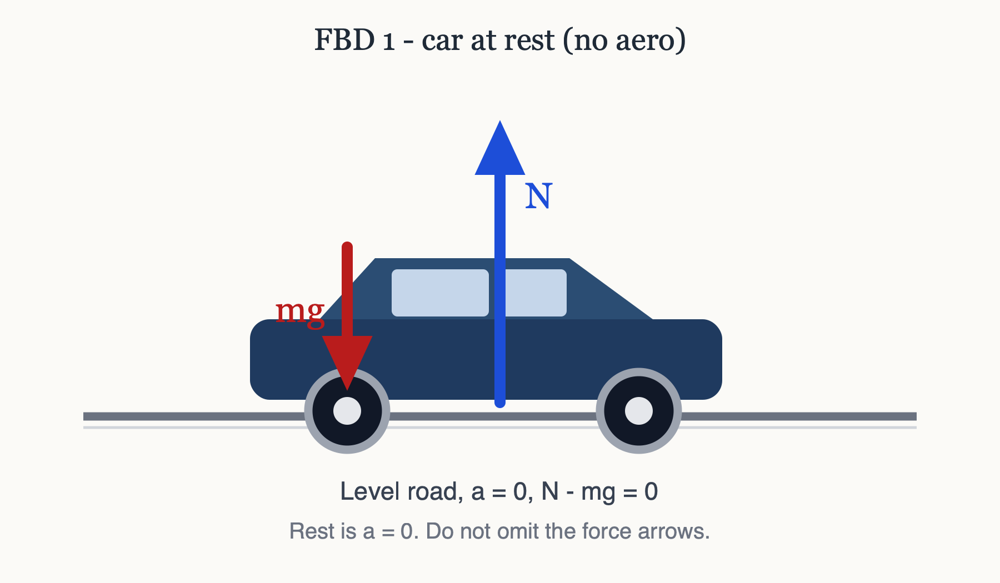
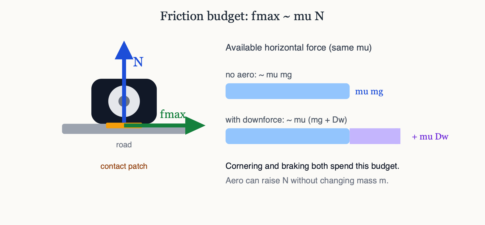
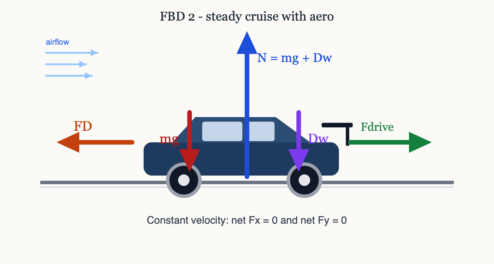
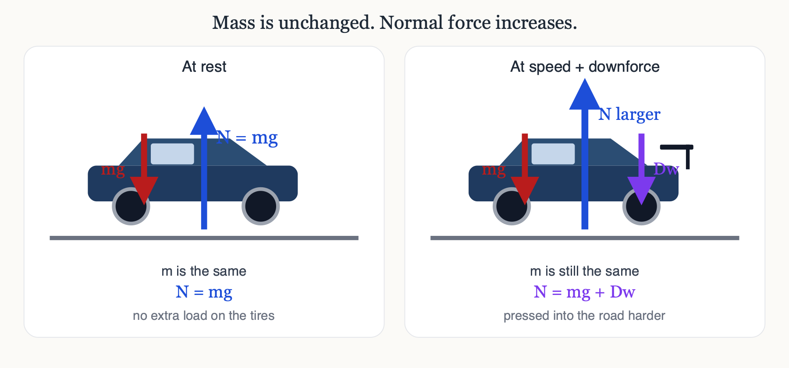
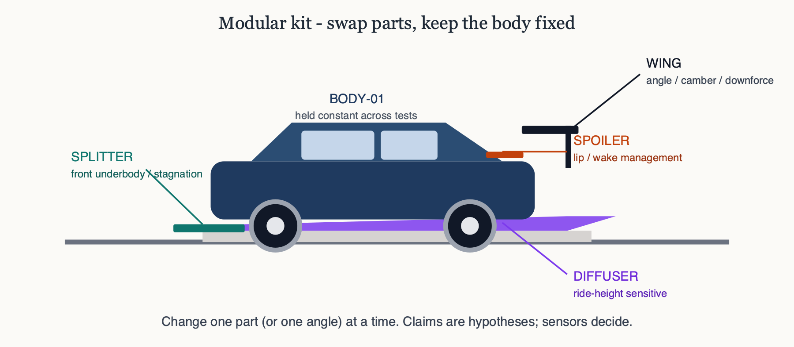
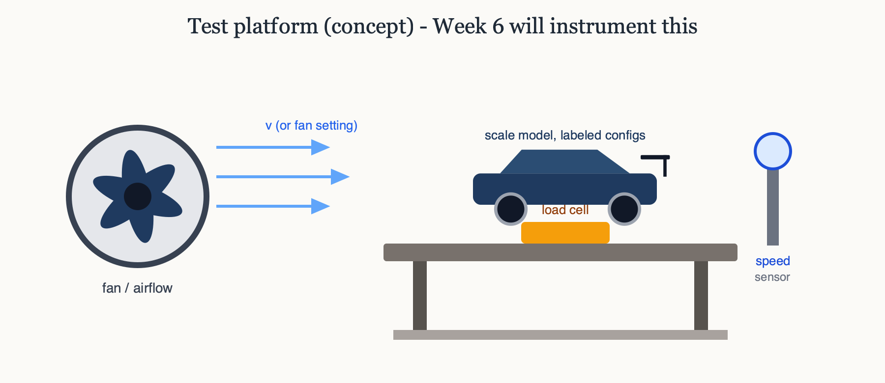

<!--
How to present: open in VS Code / Cursor with the Marp extension, or:
  npx @marp-team/marp-cli curriculum/slides/week-01-lecture.md -o week-01.pdf
GitHub shows this file as readable Markdown even without Marp.
-->

# Week 1
## Forces, free-body diagrams, and project goals

**Automotive Aerodynamics Independent Study**  
Industrial Design × Physics (DePaul)

Physics mentor · 10-week IS

---

# Today’s agenda

1. Course contract: design + measurable physics  
2. Translate the project proposal into force language  
3. Newton review → vehicle free-body diagrams  
4. Downforce, normal force, and “aero grip”  
5. Drag in steady cruise  
6. Modular parts: claims vs. quantities  
7. Success metrics & labeling  
8. Physics checkpoint (worked)  
9. Deliverables for Week 1  

---

# Learning targets (by end of Week 1)

You will be able to:

- Restate the project in **measurable** physics language (forces, not vibes)
- Draw FBDs for a car: weight, normal forces, drag, downforce, drive/brake
- Explain why downforce can increase cornering grip **without** adding engine power
- Define 2–3 success metrics your scale tests can actually check

---

# Who this course is for

| | |
|--|--|
| **You** | Industrial Design; full algebra-based intro physics done |
| **Path** | Physics minor in progress |
| **This IS** | Not a substitute for calculus fluids — a bridge that *uses* forces quantitatively |
| **Mentor role** | Physics models, experiment design, honest scaling, feedback on claims |

**Core bet:** CAD without force models fails the Physics bar; force models without a build fail the design motivation. We do both.

---

# The student proposal (compressed)

**Question:** How do spoilers, wings, splitters, and diffusers change the forces on a car?

**Method:**

1. Research modern performance aero  
2. CAD a **modular** scale vehicle (swap parts, keep body fixed)  
3. Build a test platform + sensors  
4. Compare configurations under controlled airflow  

**Our job this week:** make that plan **physically precise** before printing plastic.

---

# Forces, not vibes

| Vague design talk | Physics talk (Week 1) |
|-------------------|------------------------|
| “More aggressive aero” | Larger downforce $D_w$ and/or drag $F_D$ at a stated speed |
| “Better grip” | Larger tire normal force $N$ ⇒ larger available friction |
| “Looks fast” | Not a Week 1 metric (save aesthetics for captions later) |
| “Works great” | Measured $\Delta F$ at fixed airspeed, with replicates |

If you can’t put it on an FBD, it’s not yet a physics claim.

---

# Learning outcome LO1 (syllabus)

> Apply Newton’s laws and free-body diagrams to vehicles under aerodynamic load.

Week 1 owns this outcome. Later weeks add pressure, $C_D$/$C_L$, Bernoulli limits, and Reynolds number — but **every** later claim still comes back to forces on an FBD.

---

# Newton’s laws (algebra refresh)

**Law 1:** If $\sum \mathbf{F} = 0$, velocity is constant (including rest).

**Law 2:**

$$
\sum \mathbf{F} = m \mathbf{a}
$$

**Law 3:** Forces come in pairs — useful later for tire–road interaction; today we draw **on the car**.

**Today’s special case:** level road, constant speed ⇒ $\mathbf{a} = 0$ ⇒ each direction balances.

---

# Free-body diagram rules

1. Draw the system as a blob or simple side-view outline.  
2. Replace the world with **force arrows** only (no “motion arrows” on the FBD).  
3. Label every force with a symbol and (when known) magnitude.  
4. Choose axes: $x$ along the road, $y$ vertical.  
5. Write $\sum F_x = 0$, $\sum F_y = 0$ for steady cruise / rest.

**Tip:** Separate “what the air does” into components: drag (along flow) and downforce/lift (perpendicular). Airflow marks are *not* forces — they are context.

---

# FBD 1 — Car at rest (no aero)

Vertical only:

$$
\sum F_y = N_{\text{total}} - mg = 0
$$

$$
N_{\text{total}} = mg
$$

- $mg$: weight (down)  
- $N$: road normal (up)  
- No horizontal forces needed on level ground  

**Language:** $N$ is not “the weight,” but it **equals** $mg$ here.

---

# Checkpoint preview — Problem 1

> A $1500\,\mathrm{kg}$ car sits at rest. Total normal force from the ground (ignore aero)?

Use $g = 9.8\,\mathrm{m/s^2}$:

$$
N = mg = (1500)(9.8) = 1.47\times 10^{4}\,\mathrm{N}
$$

About $14.7\,\mathrm{kN}$ shared among the tires (distribution front/rear is a later story).

---

# Friction needs normal force

Approximate tire limit (Coulomb-style teaching model):

$$
f_{\max} \sim \mu N
$$

**Design hook:** Aero can change $N$ without changing mass $m$. Cornering and braking both spend this budget.

---

# What is downforce?

**Downforce** $D_w$: net aerodynamic force pushing the car **into the road** (useful for grip).

In aircraft language this is **negative lift**:

$$
D_w = -F_L \quad \text{(when } F_L \text{ is upward-positive)}
$$

This course: we often say “downforce” in words and use $D_w > 0$ downward, or report $F_L < 0$. **Pick one convention and keep it.**

---

# FBD 2 — Steady cruise with aero

Assume constant velocity on level road: $N = mg + D_w$ and $F_{\text{drive}} = F_D$.

  

---

# Side-view force inventory

| Symbol | Direction | Meaning |
|--------|-----------|---------|
| $mg$ | down | Weight |
| $N$ | up | Road normal (total or per axle) |
| $D_w$ | down | Aero downforce |
| $F_D$ | aft | Aero drag |
| $F_{\text{drive}}$ | forward | Tire propulsion (cruise) |
| $F_{\text{brake}}$ | aft | Tire braking (when slowing) |

Optional later: lift (up), side force, pitching moments. Week 1 = nets in $x$ and $y$.

---

# The #1 misconception

> “Downforce makes the car lighter.”

Say: *“Aero increases load on the tires,”* not *“aero reduces weight.”*

---

# Why that matters for design

Without aero, grip budget ~ $\mu mg$.

With downforce:

$$
f_{\max} \sim \mu (mg + D_w)
$$

You can corner / brake harder **at speed** if $D_w$ is large — classic race-car idea.

**Tradeoff (foreshadow):** Parts that make $D_w$ often also raise $F_D$. More grip may cost more power to hold speed. Weeks 3 and 7 make this quantitative.

---

# Checkpoint preview — Problem 2

> Same $1500\,\mathrm{kg}$ car at speed: $D_w = 2000\,\mathrm{N}$, $F_D = 800\,\mathrm{N}$. Steady cruise.

**Vertical:**

$$
N = mg + D_w = 14700 + 2000 = 16700\,\mathrm{N}
$$

**Horizontal:** drive force balances drag:

$$
F_{\text{drive}} = F_D = 800\,\mathrm{N}
$$

Normal force **rose by $2000\,\mathrm{N}$** (~14% in this example). Drag did **not** cancel weight; it is a separate horizontal balance.

---

# “Aero grip” in one paragraph (checkpoint 3)

**Target explanation (model answer):**

> Grip depends on how hard the tires are pressed into the road. At rest that press is just the car’s weight. At speed, aerodynamic downforce adds an extra downward force, so the road’s normal force increases even though the car’s mass is unchanged. Larger normal force allows larger friction forces for cornering or braking. That is “aero grip”: Newton’s laws plus $f_{\max}\sim\mu N$, not magic airflow cosmetics.

Your paragraph should hit: **mass unchanged**, **$N$ increases**, **friction can increase**.

---

# Drag is the price of speed (and often of downforce)

In steady cruise:

$$
F_{\text{drive}} = F_D
$$

Power (preview, not required today):

$$
P = F_{\text{drive}}\, v = F_D\, v
$$

Higher drag at the same speed ⇒ more power from the powertrain (or a lower top speed for a given power).

Industrial design implication: a spectacular wing that doubles drag may be the wrong product goal.

---

# Translate design claims → physics

| Design claim | Physics translation |
|--------------|---------------------|
| “More grip” | Larger $N$ and/or better $\mu$ → larger usable tire force |
| “More stable at speed” | Often load distribution / moments (advanced); start with net $D_w$ and $F_D$ |
| “More efficient aero” | High $D_w/F_D$ or meet a $D_w$ target with less drag |
| “Cleaner look” | Aesthetic — fine, but separate from force metrics |

Week 1 homework: write this table for **your** modular parts list.

---

# Modular parts — what each is *claimed* to do

---

# Modular parts — physics quantities to watch

| Part | Common claim | Watch |
|------|--------------|-------|
| **Spoiler** | Mild downforce / wake | $D_w$, $F_D$, rear load |
| **Wing** | Strong downforce vs. angle | $D_w$, $F_D$, stall |
| **Splitter** | Front underbody / stagnation | Front $N$, $F_D$ |
| **Diffuser** | Pressure recovery | Ride height, $D_w$, $F_D$ |

Claims are hypotheses. **Sensors** decide.

---

# Keep the body fixed — science reason

Modular rule: change **one** aero part (or one angle) at a time.

Otherwise you cannot tell whether $\Delta F$ came from the wing, the splitter, or an accidental ride-height change.

Experimental design starts now — not in Week 6.

---

# What we will measure later (so metrics make sense now)

Eventually (Weeks 6–9):

- Airspeed $v$ (or calibrated fan setting)  
- Drag force $F_D$  
- Vertical load change related to $D_w$  
- Geometry: AoA, ride height  

Week 3 wraps these as $C_D$, $C_L$.  
Week 1: **forces are the truth layer.**

---

# Scale-model reality check

Example from the notes: $12.0\,\mathrm{kg}$ model

$$
N_{\text{rest}} = mg \approx 118\,\mathrm{N}
$$

If aero downforce is only $2.5\,\mathrm{N}$:

$$
N \approx 120.5\,\mathrm{N}
$$

That’s a **~2%** change in total normal — easy to lose in noise if you only weigh the whole model crudely.

**Implication:** plan sensitive force sensing or a fixture where the load cell sees aero force clearly.

---

# Define success metrics (due this week)

Pick **2–3** that a sensor can check. Examples:

1. At fixed fan setting, adding WING-01 increases measured downforce by ≥ $X\,\mathrm{N}$ vs. baseline (3 replicates).  
2. Repeatability: same config, $\sigma$ of $F_D$ within $Y\%$ of the mean.  
3. Efficiency interest: maximize $D_w/F_D$ among tested wings at that speed.  
4. Process: every run labeled with config ID + photo of setup.

Avoid: “looks aerodynamic,” “feels faster,” unverified full-scale top speed claims.

---

# Labeling scheme (required)

Physical part ↔ CAD file ↔ data row:

| ID pattern | Example |
|------------|---------|
| `BODY-##` | `BODY-01` |
| `WING-##` | `WING-01` |
| `SPOIL-##` | `SPOIL-01` |
| `SPLIT-##` | `SPLIT-02` |
| `DIFF-##` | `DIFF-01` |
| `BASE-00` | body with no aero bolt-ons |

Put the same ID on the printed part (marker/engraving) and in the CSV.

---

# One-page project brief (structure)

1. **Design question** (one sentence)  
2. **Physics quantities** you will change/measure ($D_w$, $F_D$, …)  
3. **Success metrics** (2–3, measurable)  
4. **Modular parts list** with claimed function each  
5. **Test platform sketch** (box + fan + fixture is fine)  
6. **Open risks** (sensor sensitivity, unknown airspeed, …)

Submit as `docs/week-01-project-brief.md` (or PDF) in the repo.

---

# Worked checkpoint — full solutions

**1.** $N = mg = 1500\times 9.8 = 1.47\times 10^{4}\,\mathrm{N}$.

**2.** Cruise FBD: $N = 16700\,\mathrm{N}$; $F_{\text{drive}}=800\,\mathrm{N}$ balances drag. Downforce raised $N$; drag is horizontal.

**3.** Aero grip paragraph: mass fixed; $N=mg+D_w$; $f_{\max}\sim\mu N$.

Bring your own wording to discussion — mentor will watch for “lighter car” language.

---

# In-class sketch exercise (10 minutes)

Cover the next slides. Draw **two** FBDs side by side:

**A.** Car at rest  **B.** Steady cruise with $D_w$ and $F_D$

Checklist:

- [ ] Weight down  
- [ ] Normal up  
- [ ] Downforce down (on B)  
- [ ] Drag aft (on B)  
- [ ] Drive forward (on B)  
- [ ] No “velocity arrow” pretending to be a force  

Then compare to the rest and cruise figures.  

---

# Design / build tasks this week

- [ ] List modular parts + one-sentence **claim** each  
- [ ] Define 2–3 success metrics  
- [ ] Sketch or photograph intended test platform  
- [ ] Choose labeling scheme and start a BOM stub in `cad/bom.md`  
- [ ] Optional: mood-board of reference cars — but caption each with a *force hypothesis*

Physics before filament when possible.

---

# Deliverables checklist

| Deliverable | Where |
|-------------|--------|
| Checkpoint answers (1–3) | notes or `curriculum/week-01-checkpoint.md` |
| One-page project brief | `docs/week-01-project-brief.md` |
| Parts list + IDs | brief or `cad/bom.md` |
| Platform sketch/photo | `docs/` or `cad/notes/` |

Due before Week 2 meeting.

---

# How you will be assessed on Week 1

From the syllabus spine: weekly checkpoints matter (suggested 30% of course).

**Strong Week 1 work:**

- Correct FBDs and $N=mg+D_w$  
- Clear metrics  
- No “downforce = lighter”  

**Weak Week 1 work:**

- Only aesthetic renders  
- Metrics you cannot measure  
- Aero claims with no force symbols  

---

# Looking ahead — Week 2

**Pressure, density, and dynamic pressure**

$$
q = \tfrac12 \rho v^2
$$

Why aero forces grow roughly like $v^2$, and how to sketch high/low pressure faces on a wing or splitter.

Bring your parts list — we will annotate pressure hypotheses on your sketches.

---

# Instructor talking points (optional slide)

- Correct “lighter” language early; it resurfaces all term.  
- If the student jumps to CAD: ask “what force changes, by how much, at what speed?”  
- Sensor sensitivity: surface the 2% example so Week 6 calibration is motivated.  
- Keep Week 1 algebra-only; save Bernoulli fights for Week 4.

---

# References for this lecture

- Course note: [`physics/01-forces-and-fbds.md`](../../physics/01-forces-and-fbds.md)  
- Week plan: [`curriculum/week-01-forces-and-goals.md`](../week-01-forces-and-goals.md)  
- Proposal: [`docs/proposal.md`](../../docs/proposal.md)  
- Syllabus LO1: [`curriculum/SYLLABUS.md`](../SYLLABUS.md)  
- Figures: [`curriculum/slides/figures/`](figures/) (original course diagrams)

---

# End of Week 1 lecture

**Next actions for the student**

1. Finish checkpoint in your own words  
2. Write the one-page brief  
3. Sketch the platform  
4. Push to the course GitHub repo  

Questions?
