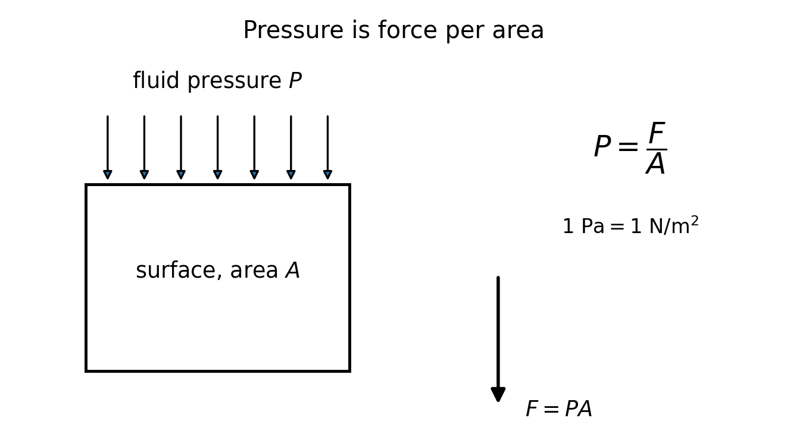
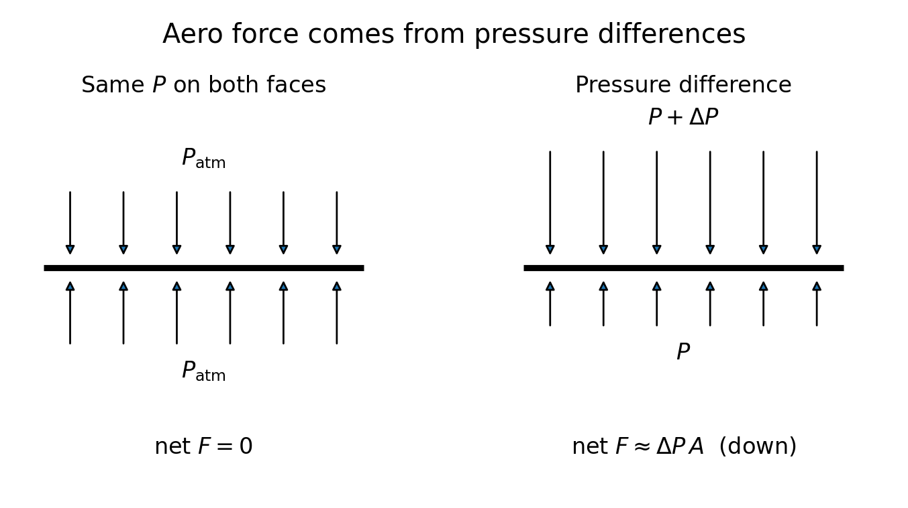
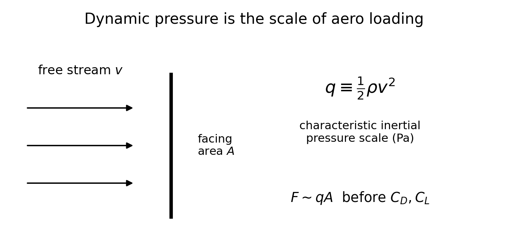
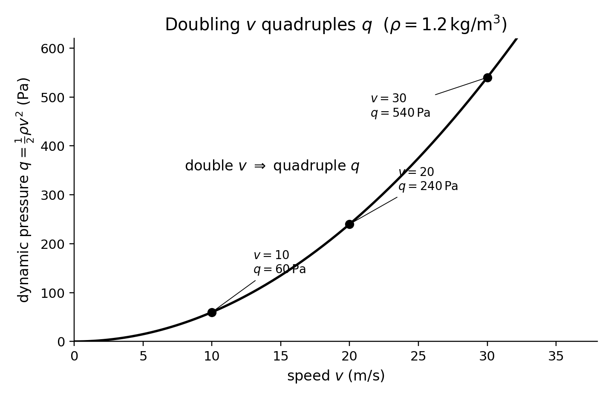
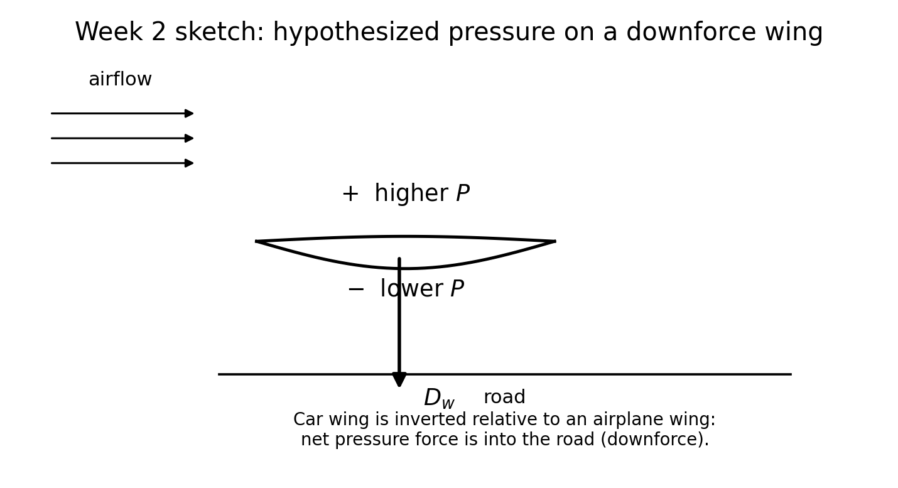
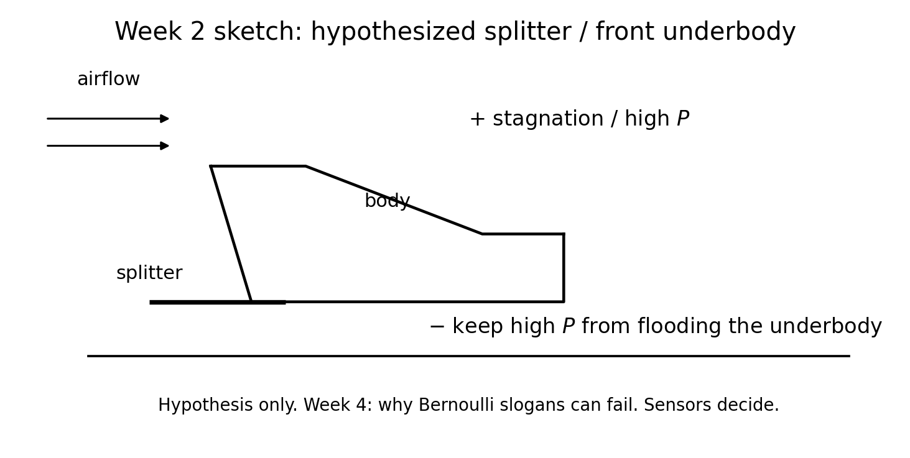

<!--
npx @marp-team/marp-cli curriculum/slides/week-02-lecture.md -o curriculum/slides/week-02-lecture.pdf --allow-local-files
-->

# Week 2
## Pressure, density, and dynamic pressure

**Automotive Aerodynamics Independent Study**  
Industrial Design × Physics (DePaul)

Physics mentor · 10-week IS

---

# Today’s agenda

1. Recap Week 1: forces from the CM, $N=mg+D_w$  
2. Where aero forces come from: pressure (and a little shear)  
3. Units: pascal, density  
4. Why **differences** in $P$ matter, not $P_{\mathrm{atm}}$ itself  
5. Dynamic pressure $q=\tfrac12\rho v^2$  
6. Why aero loads grow like $v^2$  
7. Worked checkpoint  
8. Pressure-region sketches: wing and splitter  
9. Target test speeds and $q$  
10. Deliverables  

---

# Learning targets (by end of Week 2)

You will be able to:

- Use units for pressure ($\mathrm{Pa}=\mathrm{N/m^2}$) and density ($\mathrm{kg/m^3}$)
- Compute $q=\tfrac12\rho v^2$ and explain why aero forces grow roughly with $v^2$
- Map qualitative high/low pressure regions on a wing or splitter **as hypotheses**
- Choose a target model airspeed and convert it to $q$

---

# Recap — Week 1 still governs

Particle-model FBD: every force is drawn from the center of mass.

$$
N = mg + D_w, \qquad F_{\mathrm{drive}} = F_D \quad (a=0)
$$

Downforce does **not** change mass. It changes **load** $N$, so the tire friction budget $f_{\max}\sim\mu N$ can rise at speed.

Week 2 asks: **what in the air produces $D_w$ and $F_D$?**

---

# Learning outcome LO2 (syllabus)

> Use pressure, density, and dynamic pressure $q=\tfrac12\rho v^2$ correctly.

Week 3 will wrap $q$ into $C_D$ and $C_L$.  
Week 4 will add Bernoulli — and when it lies.  
Do not skip to slogans. Get $P$, $\rho$, and $q$ solid first.

---

# Fluids push; net force is an imbalance

Air is a fluid. It pushes on every exposed face.

Two contributions to the force on a body:

| Contribution | Everyday name | Week 2 status |
|--------------|---------------|----------------|
| Pressure (normal to the surface) | “push” | **Main story** |
| Viscous shear (tangent) | “skin friction” | Mention; measure later as part of $F_D$ |

For spoilers, wings, splitters, and bluff bodies, **pressure imbalance** usually dominates the force you care about.

---

# Pressure

$$
P = \frac{F}{A}, \qquad [P]=\mathrm{Pa}=\mathrm{N/m^2}
$$

---

# Atmosphere is huge — and mostly cancels

Standard sea-level pressure:

$$
P_{\mathrm{atm}} \approx 1.01\times 10^{5}\,\mathrm{Pa} = 101\,\mathrm{kPa}
$$

On a $0.02\,\mathrm{m^2}$ plate that would be

$$
F_{\mathrm{one\ side}} \approx (1.01\times 10^{5})(0.02) \approx 2000\,\mathrm{N}
$$

You do **not** feel 2000 N of “air weight” on a notebook. The other side is also at $\sim P_{\mathrm{atm}}$.

**Language:** aero force is not “air pressure.” It is **$\Delta P$**.

---

# Why differences?

If the two faces of a thin part see $P$ and $P+\Delta P$,

$$
F_{\mathrm{net}} \approx \Delta P\, A
$$
Direction: from the higher-$P$ face toward the lower-$P$ face.

---

# Checkpoint preview — Problem 3

> Why is “air pressure” alone not enough?

Because $P_{\mathrm{atm}}$ on opposite faces nearly cancels.  
The force that shows up on a load cell is about the **imbalance** $\Delta P$, plus shear.

If your CAD caption says “high pressure underneath,” you must mean **higher than the other side**, not “the air has pressure.”

---

# Density

Near room conditions a working value is

$$
\rho_{\mathrm{air}} \approx 1.2\,\mathrm{kg/m^3}
$$

Use this unless you measure better (temperature, altitude, humidity).

Density is mass per volume. It appears in $q$ because faster, denser air has more momentum to redirect.

**This term:** freeze $\rho=1.2\,\mathrm{kg/m^3}$ in early calculations; note it in the lab notebook if the weather changes.

---

# Dynamic pressure

$$
q \equiv \tfrac12 \rho v^2
$$

Same units as pressure (Pa): characteristic inertial (“ram”) scale of the free stream.

---

# Why $v^2$?

Kinetic energy per volume of the stream is $\tfrac12\rho v^2$.  
Doubling speed **quadruples** that scale.

So if $\Delta P$ is some fraction of $q$, aero **forces** also grow like $v^2$ (until the flow pattern itself changes — stall, Week 7; Reynolds number, Week 5).

This is why:

- Race-car aero “comes on” with speed  
- A small model at modest fan speed may still produce only a few newtons  
- Safety: loads explode if you crank the fan thoughtlessly  

---

# Worked $q$ (checkpoint 1)

Use $\rho=1.2\,\mathrm{kg/m^3}$.

| $v$ (m/s) | $v^2$ | $q=\tfrac12\rho v^2$ (Pa) |
|-----------|-------|---------------------------|
| 10 | 100 | $0.6\times 100=60$ |
| 20 | 400 | $0.6\times 400=240$ |
| 30 | 900 | $0.6\times 900=540$ |

$20=2\times 10$ but $240=4\times 60$. **Factor of 4 when speed doubles.**

---

# The $q(v)$ curve

Mark your planned fan / tunnel speeds on a copy of this plot.

---

# Order of magnitude: $F\sim qA$

Before coefficients (Week 3), estimate

$$
F \sim q A
$$

Example from the notes: $v=20\,\mathrm{m/s}$, $q=240\,\mathrm{Pa}$, $A=0.020\,\mathrm{m^2}$

$$
qA = 4.8\,\mathrm{N}
$$

If a sensor cannot resolve $\sim 0.1\,\mathrm{N}$, this speed/area combination may still be usable. If $qA$ is $0.2\,\mathrm{N}$, worry (Week 1 scale-model note).

---

# Checkpoint 2 — $\Delta P\,A$

> $A=0.020\,\mathrm{m^2}$, average $\Delta P=150\,\mathrm{Pa}$. Force magnitude? Direction?

$$
F \approx \Delta P\, A = (150)(0.020) = 3.0\,\mathrm{N}
$$

Direction: high $P$ $\to$ low $P$.  
You must mark which face is which on the sketch. The number alone has no meaning without that.

Compare: $q$ at $20\,\mathrm{m/s}$ is $240\,\mathrm{Pa}$, so $\Delta P=150\,\mathrm{Pa}$ is a plausible fraction of $q$ ($C\sim\Delta P/q\sim 0.6$).

---

# Design sketches are hypotheses

You will annotate CAD: “this face high $P$,” “that face low $P$.”

Those marks are **predictions**, not decorations. Week 6–9 sensors test them.

Week 4 will explain Bernoulli’s $P+\tfrac12\rho v^2$ along a streamline — and why a stalled spoiler is **not** a Bernoulli story.

Today: qualitative maps only, tied to $\Delta P$ and $q$.

---

# Inverted wing (downforce)

Airplane wing: lower $P$ on top $\Rightarrow$ lift **up**.  
Car wing: inverted $\Rightarrow$ lower $P$ toward the road $\Rightarrow$ net force **down**.

---

# Splitter (front)

Hypothesis: the splitter sees high pressure near the nose (stagnation) and helps keep that high pressure from flooding the underbody, so the underbody can run lower $P$.

Ride height will matter (Week 8). Do not claim a full diffuser theory yet.

---

# In-class: annotate two of *your* parts

Take WING-xx and SPLIT-xx (or SPOIL / DIFF).

For each:

1. Arrow for relative wind  
2. $+$ / $-$ on faces  
3. Expected net $D_w$ and $F_D$ directions (Week 1 FBD)  
4. One sentence: “I will believe this if the load cell shows …”

These sketches are a Week 2 deliverable.

---

# Target test speed $\to$ $q$ table

Pick a realistic model speed range (fan, not a highway). Example:

| Setting | $v$ (m/s) | $q$ (Pa) at $\rho=1.2$ | $qA$ if $A=0.015\,\mathrm{m^2}$ |
|---------|-----------|-------------------------|----------------------------------|
| low | 8 | 38 | 0.58 N |
| mid | 12 | 86 | 1.3 N |
| high | 16 | 154 | 2.3 N |

If you cannot measure $v$ yet, record **fan setting** and plan a calibration (Week 6). Still compute $q$ for the $v$ you *hope* to hit.

---

# Physics checkpoint (full)

1. $q=60$, $240$, $540\,\mathrm{Pa}$; doubling $v$ multiplies $q$ by 4.  
2. $F\approx 3.0\,\mathrm{N}$, high $P$ toward low $P$.  
3. Net force needs $\Delta P$, because $P_{\mathrm{atm}}$ cancels on opposite faces.

Bring units. “About 200” with no Pa is not done.

---

# Design / build tasks this week

- [ ] Annotated pressure sketches for $\ge 2$ parts  
- [ ] Target speed / $q$ table for the platform  
- [ ] If $v$ is unknown: write how you will measure or calibrate it  
- [ ] Keep part IDs from Week 1 (`WING-01`, …)

Physics before filament: a pretty wing with no $+$/$-$ map is not yet a Week 2 artifact.

---

# Deliverables checklist

| Deliverable | Where |
|-------------|--------|
| Checkpoint 1–3 with units | notes or `curriculum/week-02-checkpoint.md` |
| Pressure sketches ($\ge 2$ parts) | `cad/notes/` or `docs/` |
| Speed / $q$ table | brief addendum or lab notebook |

Due before Week 3 meeting.

---

# How you will be assessed on Week 2

**Strong:** correct $q$ arithmetic; $\Delta P$ language; honest sketches labeled as hypotheses.  
**Weak:** “the air is fast so pressure is low” with no $\Delta P$, no $q$, and no units.  
Save the Bernoulli fight for Week 4 — but do not invent it early as a magic spell.

---

# Looking ahead — Week 3

The engineering models:

$$
F_D = q\, C_D A, \qquad F_L = q\, C_L A
$$

You will pick a **reference area** $A$ for the whole term and treat downforce as **negative lift**.

Bring your $q$ table and a first estimate of frontal area.

---

# Instructor talking points

- If $v$ is unknown, do not let $q$ remain decorative — force a measurement plan.  
- Watch for “the atmosphere pushes the car down.” Redirect to $\Delta P$.  
- Keep Bernoulli qualitative at most; Week 4 owns the assumptions.  
- Connect every pressure sketch back to the Week 1 FBD (where does $D_w$ sit?).

---

# References for this lecture

- Course note: [`physics/02-pressure-and-dynamic-pressure.md`](../../physics/02-pressure-and-dynamic-pressure.md)  
- Week plan: [`curriculum/week-02-pressure-and-dynamic-pressure.md`](../week-02-pressure-and-dynamic-pressure.md)  
- Week 1 FBD: [`physics/01-forces-and-fbds.md`](../../physics/01-forces-and-fbds.md)  
- Syllabus LO2: [`curriculum/SYLLABUS.md`](../SYLLABUS.md)  
- Figures: [`curriculum/slides/figures/`](figures/)

---

# End of Week 2 lecture

**Next actions**

1. Finish checkpoint with units  
2. Annotate two parts  
3. Publish a $v$–$q$ table  
4. Push to the course GitHub repo  

Questions?
