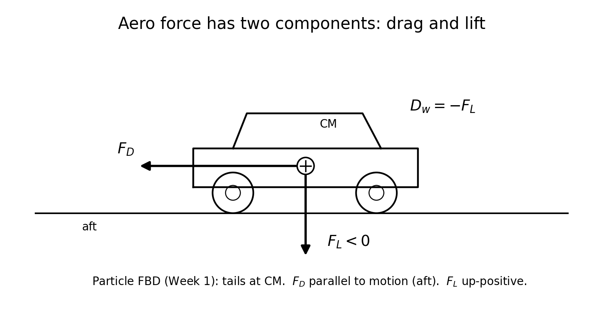
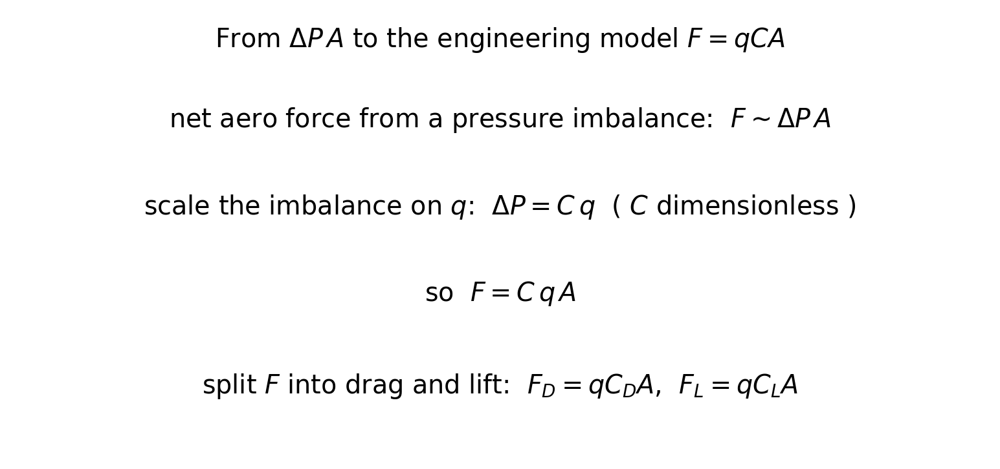
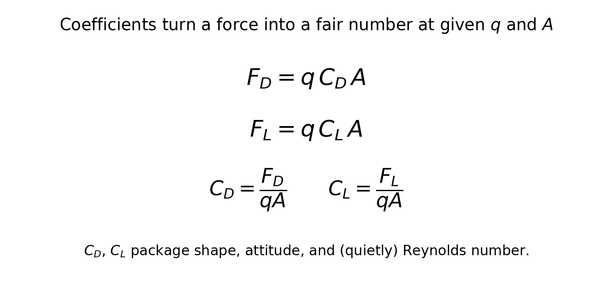
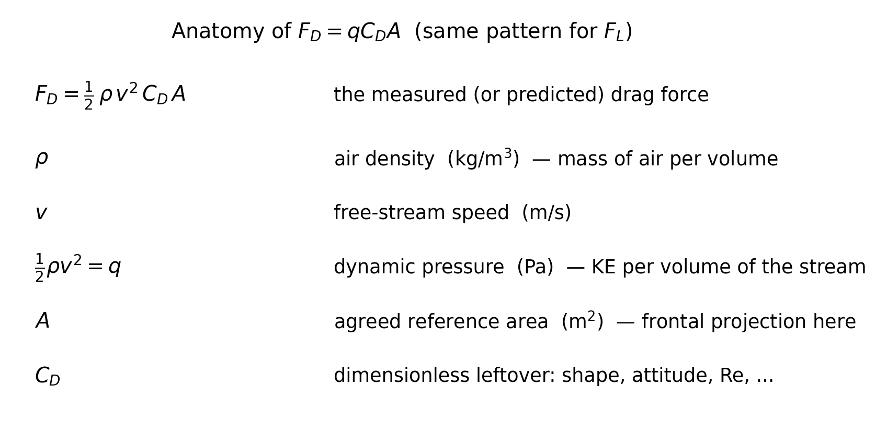
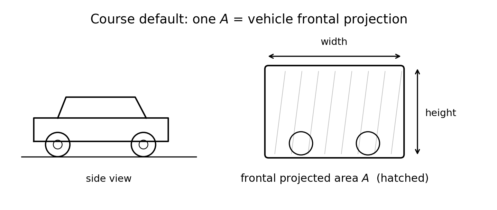
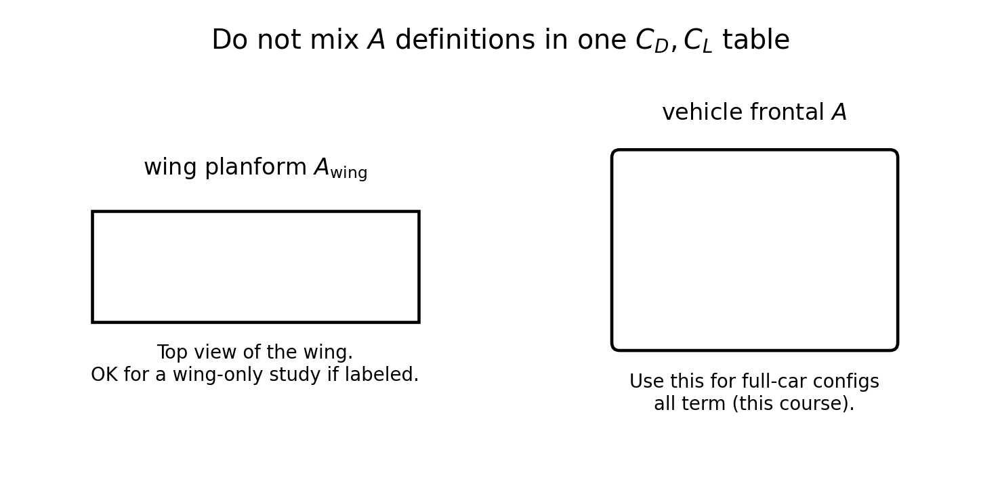
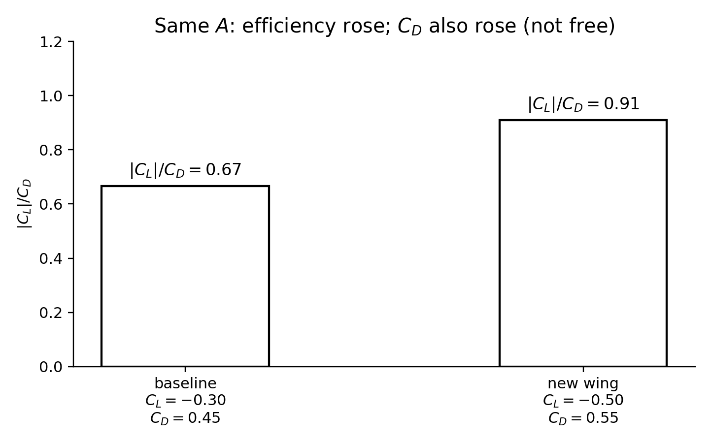

<!--
npx @marp-team/marp-cli curriculum/slides/week-03-lecture.md -o curriculum/slides/week-03-lecture.pdf --allow-local-files
-->

# Week 3
## Drag, lift, and force coefficients

**Automotive Aerodynamics Independent Study**  
Industrial Design × Physics (DePaul)

Physics mentor · 10-week IS

---

# Today’s agenda

1. Recap: $\rho$, $q=KE/V$, and $F\sim\Delta P\,A$  
2. Split aero force into drag and lift  
3. Sign convention: downforce is negative lift  
4. Derive $F=qCA$ from $\Delta P\,A$  
5. Anatomy of each symbol in $F_D=\tfrac12\rho v^2 C_D A$  
6. Reference area $A$ — pick one and freeze it  
7. Worked checkpoint (including efficiency)  
8. Order-of-magnitude $C_D$  
9. CAD v1: body + wing, record AoA  
10. Deliverables  

---

# Learning targets (by end of Week 3)

You will be able to:

- Derive $F=qCA$ from $F\sim\Delta P A$ with $\Delta P=C q$
- Write and use $F_D=\tfrac12\rho v^2 C_D A$ and $F_L=\tfrac12\rho v^2 C_L A$, naming each symbol
- Treat **downforce as negative lift** (one convention for the term)
- Estimate order-of-magnitude forces for the scale model
- Define a **single reference area** $A$ for comparing configs

---

# Recap — Weeks 1 and 2

**Week 1:** $N=mg+D_w$, $F_{\mathrm{drive}}=F_D$, forces from the CM.  
**Week 2:** density $\rho=m/V$ (unit $\mathrm{kg/m^3}$) turns a blob’s kinetic energy into a pressure scale

$$
q \equiv \frac{KE}{V} = \tfrac12\rho v^2
$$

Net aero force is about $\Delta P$, and a first estimate was $F\sim qA$.  
Today we insert the missing numbers $C_D$ and $C_L$ so different *shapes* can be compared at the same $q$ and $A$.

---

# Learning outcome LO3 (syllabus)

> Predict and measure drag and lift/downforce coefficients for modular parts.

You cannot measure $C_D$ until Week 6–7. You **can** already:

- Predict a plausible range  
- Compute $F_D$, $F_L$ from assumed $C_D$, $C_L$  
- Freeze $A$ so later measurements are comparable  

Week 5 will warn that $C_D$ at model Re is not automatically the full-car $C_D$.

---

# Drag and lift are components

Relative to the free-stream direction:

- **Drag** $F_D$: parallel to the oncoming flow (resists motion; aft on the car)  
- **Lift** $F_L$: perpendicular to the oncoming flow (aircraft sense: **up** positive)

Tails at the CM (Week 1 particle FBD). $F_L$ up-positive, so downforce is $D_w=-F_L$.

---

# Particle FBD: two aero components

---

# Course sign convention (freeze this)

$$
D_w = -F_L \quad \text{when } F_L \text{ is up-positive}
$$

If $C_L=-0.30$, the vertical aero force is **down** (downforce).

**Do not mix** “positive downforce” in a table with “positive $C_L$ up” unless you say so.  
This course’s spreadsheets: **$F_L$ and $C_L$ up-positive**; report $D_w$ in words or as $|F_L|$ when $F_L<0$.

---

# From $\Delta P\,A$ to $F=qCA$

Week 2: if two faces of a part see a pressure difference, the net force has size

$$
F \sim \Delta P\, A
$$

$\Delta P$ is some fraction of the stream’s kinetic-energy density $q$:

$$
\Delta P = C\, q
$$

$C$ is **dimensionless** (Pa/Pa). Substitute:

$$
F = C\, q\, A
$$

Split $F$ into the Week 1 components (drag aft, lift up-positive):

$$
F_D = q\, C_D\, A, \qquad F_L = q\, C_L\, A
$$

---

# Same chain as a picture

---

# The engineering models

$$
F_D = q\, C_D\, A, \qquad F_L = q\, C_L\, A, \qquad q=\tfrac12\rho v^2
$$

Equivalently:

$$
C_D = \frac{F_D}{qA}, \qquad C_L = \frac{F_L}{qA}
$$

$C_D$ and $C_L$ are dimensionless. They let you compare shapes at different speeds once $q$ and $A$ are known.

---

# Compact form

---

# Anatomy of every symbol

Same pattern for lift: replace $D$ with $L$.

---

# Units of every symbol

| Symbol | Meaning | SI unit |
|--------|---------|---------|
| $\rho$ | mass of air per volume | $\mathrm{kg/m^3}$ |
| $v$ | free-stream speed | $\mathrm{m/s}$ |
| $q=\tfrac12\rho v^2$ | KE per volume of the stream | $\mathrm{Pa}$ |
| $A$ | agreed reference area (frontal here) | $\mathrm{m^2}$ |
| $C_D$ | leftover shape / attitude / Re factor | dimensionless |
| $F_D$ | drag force | $\mathrm{N}$ |

Do not hide a second $v^2$ inside $C_D$. Speed already lives in $q$.

---

# What $C_D$ and $C_L$ “contain”

They are **dimensionless**. They fold in:

- Shape (body, wing, gaps, wheels)  
- Attitude (angle of attack, ride height)  
- Quietly: Reynolds number and roughness (Week 5)

They do **not** include a hidden extra factor of $v^2$ — that already sits in $q$.

If you change only speed and the flow pattern stays similar, $C_D$ is roughly constant and $F_D\propto v^2$.

---

# Stretch: why engineers like $C_D$

From $F_D = q C_D A$,

$$
C_D = \frac{F_D}{qA}
$$

Same $C_D$ lets you compare:

- A 1:10 model at 12 m/s to another config at 16 m/s  
- (With Re honesty) published car data at different speeds  

A raw force in newtons is **not** comparable until you divide by $qA$.

---

# Reference area $A$ is a convention

$C_D$ is meaningless without saying which $A$.

**This independent study (default):** whole-vehicle **frontal (projected) area**.  
Use it for every full-car config so a wing swap changes $C_D$, $C_L$, not $A$.

---

# Frontal $A$ (the one we freeze)

---

# Do not mix area definitions

If you ever quote a wing-only $C_L$ using planform area, **write $A_{\mathrm{wing}}$** in the table header.

---

# Project rule (write this down)

1. Measure or estimate frontal $A$ of BODY-01 (with wheels, no extra wing if that is your baseline — **say which**).  
2. Keep that $A$ for BASE-00, WING-01, SPLIT-02, …  
3. Record $A$ in every CSV (`ref_area_m2` in the lab template).

Changing $A$ mid-term makes Week 9 comparisons garbage.

---

# Worked checkpoint 1 — drag

$A=0.015\,\mathrm{m^2}$, $v=15\,\mathrm{m/s}$, $\rho=1.2\,\mathrm{kg/m^3}$, $C_D=0.45$.

$$
q = \tfrac12(1.2)(225) = 135\,\mathrm{Pa}
$$

$$
F_D = q C_D A = (135)(0.45)(0.015) = 0.911\,\mathrm{N}
$$

About $0.91\,\mathrm{N}$ aft. That is a small force — exactly the Week 1 sensor-sensitivity warning.

---

# Worked checkpoint 2 — downforce

Same $q$ and $A$, $C_L=-0.30$.

$$
F_L = (135)(-0.30)(0.015) = -0.608\,\mathrm{N}
$$

Vertical aero force is $0.61\,\mathrm{N}$ **down** ($D_w=0.61\,\mathrm{N}$).

On the FBD: $N=mg+0.61\,\mathrm{N}$. For a $12\,\mathrm{kg}$ model, that is still a $\sim 0.5\%$ change in $N$ — measure aero force directly if you can.

---

# Worked checkpoint 3 — efficiency

Downforce-to-drag, same $A$:

$$
\mathcal{E} = \frac{|F_L|}{F_D} = \frac{|C_L|}{C_D}
$$

| Config | $C_L$ | $C_D$ | $\mathcal{E}$ |
|--------|-------|-------|----------------|
| before | $-0.30$ | $0.45$ | $0.30/0.45=0.67$ |
| after | $-0.50$ | $0.55$ | $0.50/0.55=0.91$ |

The new wing is **more efficient** by this metric. It is **not** “free”: $C_D$ rose (more drag, more power to hold speed).

---

# Same numbers as a figure

Your Week 1 success metric might be $\mathcal{E}$, or a downforce floor, or a drag cap. **State the rule** (Week 9 will reuse it).

---

# Ballpark $C_D$ (illustrative, not your model)

| Object | Typical $C_D$ |
|--------|----------------|
| Flat plate facing the flow | $\sim 1$–$2$ |
| Streamlined airfoil (section) | much smaller; Re-dependent |
| Modern road cars (full vehicle) | often $\sim 0.25$–$0.35$ |
| Boxy / bluff scale model | **often higher** than a production car |

Relative **changes** when you swap WING-01 still teach design physics even if absolute $C_D$ is “too high.”

---

# Estimate *your* model before CAD freeze

Pick $A$ from a sketch or CAD projection.  
Assume a trial $C_D\sim 0.4$–$0.8$ and $C_L$ from $0$ to $-0.5$.  
Compute $F_D$ and $F_L$ at your Week 2 $q$ values.

If both forces sit below the noise floor of the sensor, **raise $v$, enlarge $A$, or change the fixture** (Week 1 / Week 6). Do this on paper now.

---

# Geometric angle of attack

Week 7 is the AoA sweep. This week: **define and record** geometric AoA for WING-01 (chord line vs. oncoming flow or vs. the body reference).

A pretty render with unlabeled incidence is not a physics part.

---

# Design / build tasks this week

- [ ] Written definition of $A$ (how measured, what is included)  
- [ ] CAD v1: BODY-01 + at least one interchangeable wing  
- [ ] Geometric AoA recorded on the drawing  
- [ ] Checkpoint 1–4  
- [ ] Optional: predicted $C_D$, $C_L$ ranges for BASE vs WING-01  

---

# Physics checkpoint (full)

1. $q=135\,\mathrm{Pa}$, $F_D\approx 0.91\,\mathrm{N}$ aft.  
2. $F_L\approx -0.61\,\mathrm{N}$ (downforce).  
3. $\mathcal{E}:0.67\to 0.91$; after is more efficient, with a drag penalty.  
4. Stretch: $C_D=F_D/(qA)$ is dimensionless and comparable across speeds if the flow pattern holds.

---

# Deliverables checklist

| Deliverable | Where |
|-------------|--------|
| Checkpoint solutions | notes or `curriculum/week-03-checkpoint.md` |
| Definition of $A$ | project brief or `cad/notes/` |
| CAD screenshots + part IDs + AoA | `cad/` |

Due before Week 4. Midterm (Week 5) will ask for predicted $C_D$, $C_L$ ranges — start the habit now.

---

# How you will be assessed on Week 3

**Strong:** one frozen $A$; correct signs on $C_L$; $F=qCA$ arithmetic with units; efficiency discussed as a tradeoff.  
**Weak:** $C_D$ quoted with no $A$; “the wing adds 30% downforce” with no $q$; mixing planform and frontal area.

---

# Looking ahead — Week 4

Bernoulli and continuity — **and their limits**.

You will write honest captions for the diffuser and the wing: marketing claim vs. physics claim. Separation and wakes enter the vocabulary. Do not wait until then to keep $\Delta P$ and $q$ honest.

---

# Instructor talking points

- Freeze $A$ in writing this week; do not renegotiate every CAD revision.  
- If the student reports only newtons, ask for $C_D=F_D/(qA)$.  
- Efficiency is not the only goal — a design brief might demand a $D_w$ floor.  
- Preview Re (Week 5) if they treat a model $C_D$ as a street-car spec.

---

# References for this lecture

- Course note: [`physics/03-drag-and-lift.md`](../../physics/03-drag-and-lift.md)  
- Week plan: [`curriculum/week-03-drag-lift-coefficients.md`](../week-03-drag-lift-coefficients.md)  
- $q$ recap: [`physics/02-pressure-and-dynamic-pressure.md`](../../physics/02-pressure-and-dynamic-pressure.md)  
- Lab CSV columns: [`labs/data-template.csv`](../../labs/data-template.csv)  
- Figures: [`curriculum/slides/figures/`](figures/)

---

# End of Week 3 lecture

**Next actions**

1. Finish checkpoint  
2. Write the $A$ definition  
3. CAD v1 + AoA  
4. Push to the course GitHub repo  

Questions?
