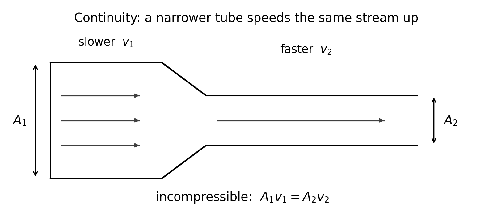
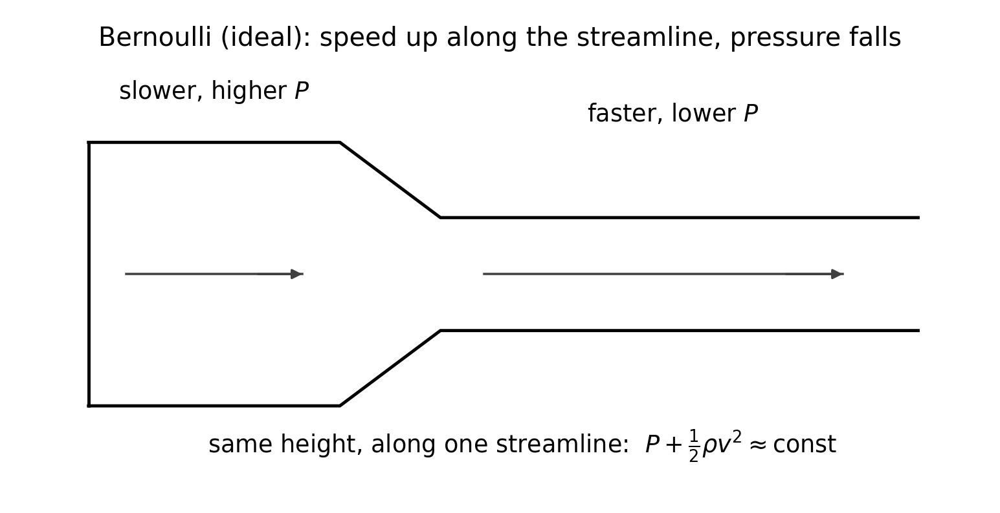
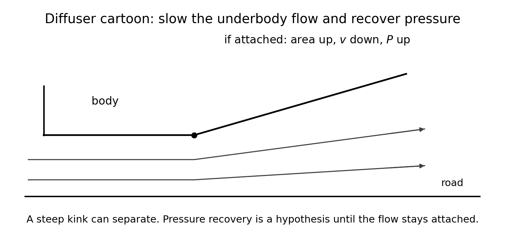
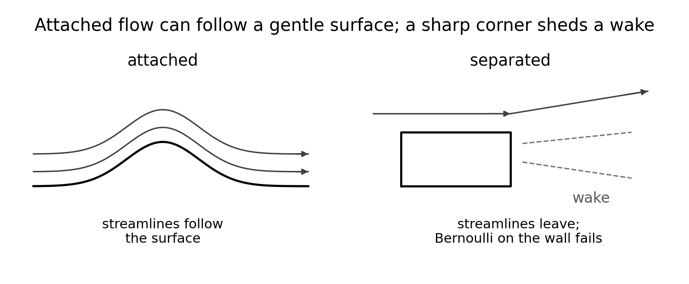
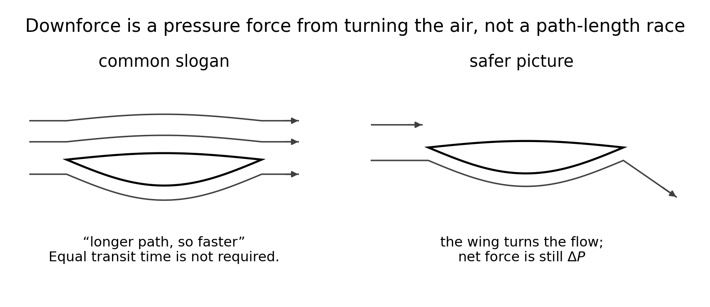

<!--
npx @marp-team/marp-cli curriculum/slides/week-04-lecture.md -o curriculum/slides/week-04-lecture.pdf --allow-local-files
-->

# Week 4
## Bernoulli, continuity, and their limits

**Automotive Aerodynamics Independent Study**  
Industrial Design × Physics (DePaul)

Physics mentor · 10-week IS

---

# Today’s agenda

1. Recap: $q$ is kinetic energy per volume; $F=qCA$  
2. Continuity: why a narrower path speeds the stream up  
3. Bernoulli: $P+\tfrac12\rho v^2$ along one streamline  
4. Worked $\Delta P$, including a diffuser  
5. Where the idealization fails: separation and wakes  
6. The path-length slogan  
7. Honest captions for the wing and the diffuser  
8. Deliverables  

---

# Learning targets (by end of Week 4)

You will be able to:

- State incompressible continuity: $A_1 v_1 = A_2 v_2$ along a streamline tube
- Write Bernoulli’s equation and compute a sample $\Delta P$ at constant height
- Say which assumptions fail for a stalled spoiler or a separated diffuser
- Write an honest caption: marketing sentence and physics sentence, side by side

---

# Recap — what still does the forcing

Weeks 1–3 still govern the car:

$$
F \sim \Delta P\, A, \qquad \Delta P = C\, q, \qquad q=\tfrac12\rho v^2
$$

$q$ is the kinetic energy in each cubic meter of oncoming air.  
$C$ is how much of that scale this shape turns into a net force.

Week 4 asks a narrower question: **along one tidy streamline, how are $P$ and $v$ related, and when is that story the wrong story?**

---

# Learning outcome LO4 (syllabus)

> Critique Bernoulli-only explanations; identify separation and wake effects qualitatively.

YouTube will say “fast air is low pressure.”  
That sentence is a **special case**, not a law of cars.

Use it where the assumptions hold. Measure $C_D$ and $C_L$ where they do not.

---

# Two conservation statements

| Statement | What is conserved | Needs |
|-----------|-------------------|--------|
| Continuity | mass per time through a tube | density about constant |
| Bernoulli | a mechanical-energy budget | steady, inviscid, along a streamline |

Continuity tells you the **speed**.  
Bernoulli turns that speed into a **pressure change**, if the flow stays ideal.

---

# Continuity (incompressible)

Air has density $\rho$. Through a cross-section of area $A$ at speed $v$, the mass flow is

$$
\dot m = \rho A v
$$

If $\rho$ is the same at two stations on one stream tube, and no air leaks through the walls,

$$
A_1 v_1 = A_2 v_2
$$

Narrower $\Rightarrow$ faster. Wider $\Rightarrow$ slower.

---

# Continuity as a picture

---

# Worked continuity

$A_1=0.020\,\mathrm{m^2}$, $v_1=10\,\mathrm{m/s}$, $A_2=0.010\,\mathrm{m^2}$, $\rho=1.2\,\mathrm{kg/m^3}$.

$$
v_2 = \frac{A_1 v_1}{A_2} = \frac{(0.020)(10)}{0.010} = 20\,\mathrm{m/s}
$$

Mass check, both stations:

$$
\dot m = (1.2)(0.020)(10) = (1.2)(0.010)(20) = 0.24\,\mathrm{kg/s}
$$

Halving the area doubled the speed. The kilograms per second did not change.

---

# Bernoulli, with the assumptions in view

For **steady, inviscid, incompressible** flow **along a streamline**:

$$
P + \tfrac12\rho v^2 + \rho g h = \text{constant}
$$

Read the middle term as $q$ on that streamline, not as the free-stream $q$ of Week 2 unless this streamline *is* the free stream.

**Assumptions, said out loud:**

1. Steady (or a fair time average)  
2. Inviscid: viscosity is not eating mechanical energy  
3. Incompressible: $\rho$ constant, which continuity already used  
4. Along **one** streamline, not from a random point to another  
5. No fan or pump doing work on that streamline between the two stations  

---

# Drop the height term for a car

Between two points a few centimeters apart in height,

$$
\rho g \Delta h \approx (1.2)(9.8)(0.05) \approx 0.6\,\mathrm{Pa}
$$

Speed changes in these problems move $P$ by **tens or hundreds of pascals**.  
For a quick car estimate, same height:

$$
P_1 + \tfrac12\rho v_1^2 = P_2 + \tfrac12\rho v_2^2
$$

---

# Bernoulli stations

---

# Worked $\Delta P$ (checkpoint 1)

Speed along the streamline goes from $10$ to $20\,\mathrm{m/s}$. $\rho=1.2\,\mathrm{kg/m^3}$.

$$
P_2 - P_1 = \tfrac12\rho\left(v_1^2 - v_2^2\right)
= 0.6\,(100 - 400)
= -180\,\mathrm{Pa}
$$

Pressure is **lower in the faster region**, by $180\,\mathrm{Pa}$, inside this idealization.

Compare with Week 2: free-stream $q$ at $20\,\mathrm{m/s}$ is $240\,\mathrm{Pa}$. A $180\,\mathrm{Pa}$ change is a large fraction of that scale, which is why $C$ can be order 1.

---

# Checkpoint 1 — how to say it

> Air in a duct speeds from 10 to 20 m/s. Estimate $\Delta P$. Where is pressure higher?

$$
\Delta P = P_{\text{fast}} - P_{\text{slow}} = -180\,\mathrm{Pa}
$$

Pressure is higher where the air is **slower**.  
Units: pascals. Direction: from the high-$P$ face toward the low-$P$ face if this $\Delta P$ acts across a surface (Week 2).

---

# A diffuser, Bernoulli-only

A diffuser is a channel that **opens** in the flow direction. Continuity:

$$
A\ \text{up} \Rightarrow v\ \text{down}
$$

Bernoulli, if the flow stays attached and ideal:

$$
v\ \text{down} \Rightarrow P\ \text{up}
$$

That rise is **pressure recovery**. Under the car, a higher pressure toward the rear of the underbody is part of how a diffuser is *supposed* to help downforce: the underbody can run at lower $P$ upstream of the recovery.

---

# Diffuser cartoon

---

# Worked recovery

Attached diffuser, area doubles, speed falls from $20$ to $10\,\mathrm{m/s}$:

$$
\Delta P = 0.6\,(400 - 100) = +180\,\mathrm{Pa}
$$

That $+180\,\mathrm{Pa}$ is the ideal gift.  
A ramp that is too steep separates. Then the streamline you used **leaves the wall**, the ideal $\Delta P$ is not delivered, and the wake is the real object.

Week 8 measures ride height and diffuser shape. Today: the sign of the ideal story, and the condition “if attached.”

---

# Checkpoint 2

> A diffuser slows underbody flow as area increases. In a Bernoulli-only story, what happens to pressure? What is “pressure recovery”?

Pressure **rises** as the stream slows.  
Pressure recovery is that rise, back toward the pressure outside the channel.

Add one sentence the slogan forgets: recovery happens **if the flow stays attached**. A separated diffuser is a wake, and this $\Delta P$ is then a hypothesis you did not earn.

---

# Attached flow and a wake

---

# How to read that figure

Left: the surface is gentle, streamlines follow it, and a Bernoulli estimate along one of them can be a fair sketch.

Right: at a sharp corner the near flow leaves. Downstream is a **wake**: slow, messy, often unsteady. The wall behind the corner is not a streamline anymore.

---

# Why “fast air = low pressure” fails in a wake

Bernoulli compares two points **on the same streamline**.

In a wake:

- The air next to the surface did not get there by a tidy acceleration along that surface  
- Viscosity and separation have already spent mechanical energy  
- A low speed in the wake does **not** mean “therefore high pressure by Bernoulli”

Bluff bodies, sharp spoilers, and stalled wings make force mostly with a **pressure difference between the front and the wake**, which is the Week 3 coefficient story. It is not a single Bernoulli evaluation on the back face.

---

# The path-length slogan

You will hear: “air over the long path must go faster so the two streams meet at the trailing edge, so the pressure is lower.”

Equal transit time is **not** a law. The upper and lower streams do not have an appointment at the trailing edge.

---

# Slogan and the safer picture

Safer picture, already in Weeks 1–3: the wing **turns** the air. The net force is $\Delta P$ on the surfaces. $C_L$ is how much of $qA$ that turn produces.

---

# Checkpoint 3

> Give one reason a real rear wing’s downforce is not fully explained by “air travels farther over the top.”

Any one of these is enough:

- The two streams need not take equal time  
- If the wing stalls, the “long path” is not a surface streamline  
- The force is the pressure distribution from turning the flow, which you will **measure** as $F_L=q C_L A$

A longer camber line can be a design choice. It is not, by itself, the derivation of downforce.

---

# Checkpoint 4 — *Stretch*

> List three assumptions of Bernoulli and mark which fail for a sharp-edged spoiler in a stalled condition.

| Assumption | Stalled sharp spoiler |
|------------|------------------------|
| Inviscid | **Fails.** Separation is a viscous event |
| Along the surface streamline | **Fails.** The surface streamline has left |
| Steady | **Weak.** The wake fluctuates; a time average is the best you get |
| Incompressible | Usually still acceptable at these speeds |
| $\rho g h$ negligible | Still fine; height is not the problem |

---

# Honest captions

A caption has two sentences.

**Wing**

- Marketing: “The inverted wing presses the car into the road.”  
- Physics: “If the flow stays attached, the wing turns air toward the road and the surface $\Delta P$ is a downward force. If it stalls, that map changes and $C_L$ must be measured, not assumed from a path length.”

**Diffuser**

- Marketing: “The diffuser seals the floor and adds grip.”  
- Physics: “If the underbody stream slows while attached, Bernoulli gives pressure recovery. Ride height, the ramp angle, and separation decide whether that recovery happens. Week 8 tests it.”

Write your own in this voice. Pretty words without the assumption are not the deliverable.

---

# Where to look for separation on *your* body

Mark likely edges on the side view, as hypotheses:

- Hood to windshield  
- Roof to rear glass  
- Sharp spoiler or wing trailing edge  
- Start of a diffuser ramp (the kink in the figure)  
- Exposed wheel arches and mirror stalks, if the model has them  

Each mark needs the sentence: “I will believe this if the tufts (or the load cell) show …”  
Tufts and smoke are optional later. The sketch is due this week.

---

# Course stance

Use continuity and Bernoulli to estimate **attached** speeding-up and slowing-down.

Then ask, in this order:

1. Is the flow attached, or is there a wake?  
2. Am I still on one streamline?  
3. Did I ignore viscosity that is actually doing the separation?  

If the answer is a wake, stop the Bernoulli arithmetic and go back to $F_D=q C_D A$ and $F_L=q C_L A$.

---

# Design / build tasks this week

- [ ] Honest caption for the wing  
- [ ] Honest caption for the diffuser (or the underbody, if the diffuser is not drawn yet)  
- [ ] Separation-edge sketch on the body  
- [ ] Checkpoint 1–4 with units  

Physics before a more dramatic CAD surface: a deeper ramp with no attached-flow sentence is not yet a Week 4 artifact.

---

# Deliverables checklist

| Deliverable | Where |
|-------------|--------|
| Checkpoint 1–4 | notes or `curriculum/week-04-checkpoint.md` |
| Two honest captions | `cad/notes/` or `docs/` |
| Separation-edge sketch | with the captions |

Due before the Week 5 midterm review.

---

# How you will be assessed on Week 4

**Strong:** $\Delta P$ with units and a sign; assumptions named; captions that say when the story stops.  
**Weak:** “fast air = low pressure” on a stalled spoiler; a diffuser claim with no “if attached”; path length offered as a derivation.

---

# Looking ahead — Week 5

Reynolds number. The same shape at a much smaller $vL$ can separate in a different place, so a model $C_D$ is not a full-car $C_D$.

Bring a frozen model scale and a chosen length $L$. Week 5 is also the midterm design review.

---

# Instructor talking points

- Praise the curiosity in a Bernoulli slogan, then ask “which streamline?”  
- If the student evaluates Bernoulli inside a wake, redirect to the separated-flow figure.  
- Keep ground-effect and diffuser tuning for Week 8; this week is the ideal sign and the failure mode.  
- The height term is a good check that not every term in an equation matters at car scale.

---

# References for this lecture

- Course note: [`physics/04-bernoulli-and-limits.md`](../../physics/04-bernoulli-and-limits.md)  
- Week plan: [`curriculum/week-04-bernoulli-and-limits.md`](../week-04-bernoulli-and-limits.md)  
- $q$ and $\Delta P$: [`physics/02-pressure-and-dynamic-pressure.md`](../../physics/02-pressure-and-dynamic-pressure.md)  
- Coefficients: [`physics/03-drag-and-lift.md`](../../physics/03-drag-and-lift.md)  
- Figures: [`curriculum/slides/figures/`](figures/)

---

# End of Week 4 lecture

**Next actions**

1. Finish the checkpoint with units  
2. Write two honest captions  
3. Sketch separation edges  
4. Freeze a model scale for the Week 5 review  

Questions?
