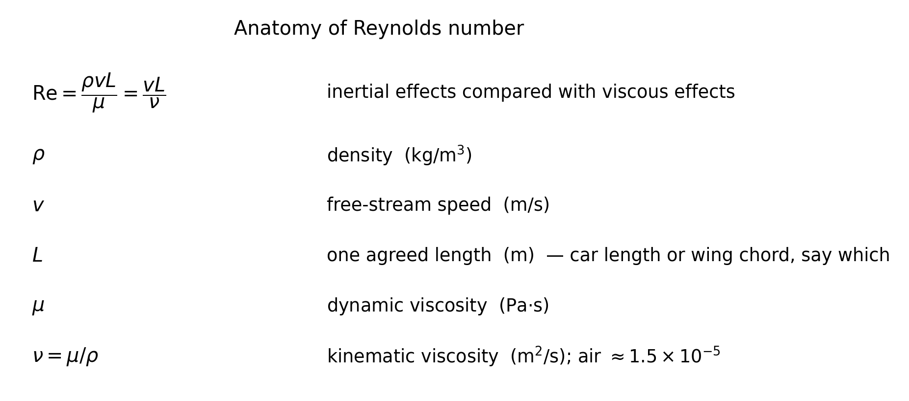
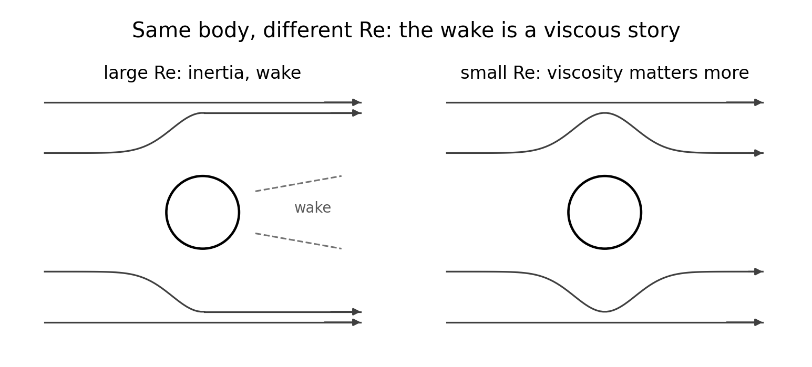
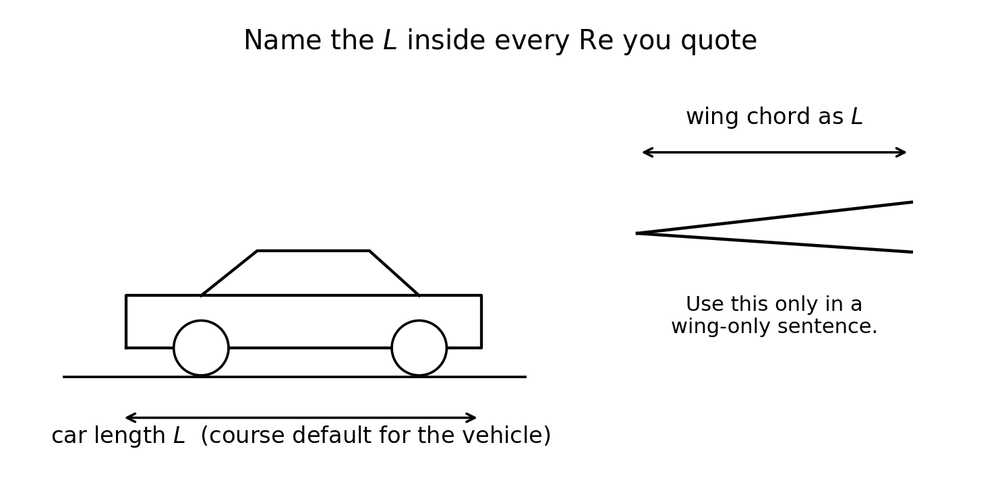
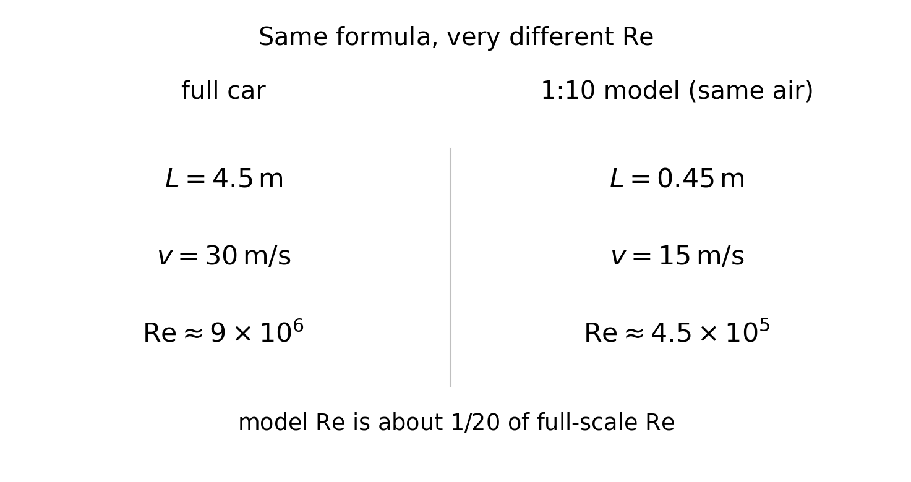
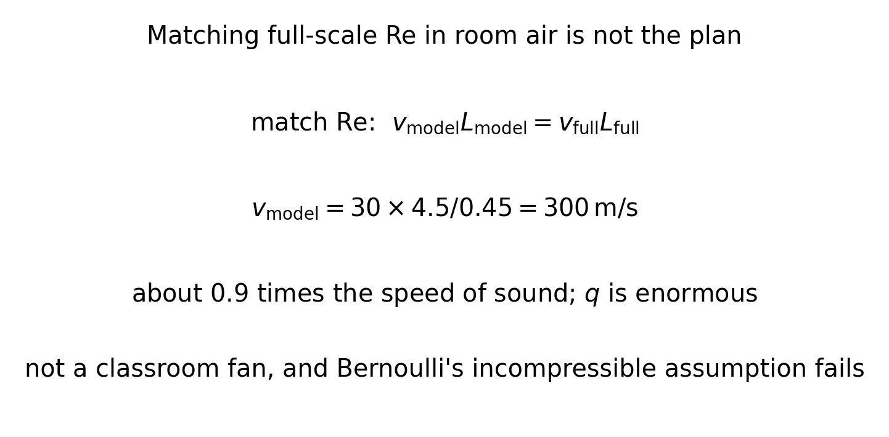

<!--
npx @marp-team/marp-cli curriculum/slides/week-05-lecture.md -o curriculum/slides/week-05-lecture.pdf --allow-local-files
-->

# Week 5
## Reynolds number, scaling, and the midterm review

**Automotive Aerodynamics Independent Study**  
Industrial Design × Physics (DePaul)

Physics mentor · 10-week IS

---

# Today’s agenda

1. Recap: $C$ quietly includes the flow pattern  
2. Define $\mathrm{Re}=\rho v L/\mu$ and name every symbol  
3. Full car vs 1:10 model, same air  
4. Why matching Re in the lab is not the plan  
5. What a scale test may claim  
6. Write the scaling disclaimer  
7. Midterm packet and test matrix  
8. Deliverables  

---

# Learning targets (by end of Week 5)

You will be able to:

- Compute $\mathrm{Re}=v L/\nu$ with a stated length $L$ and $\nu_{\mathrm{air}}\approx 1.5\times 10^{-5}\,\mathrm{m^2/s}$
- Explain why a small model in room air is usually at a much lower Re
- Separate claims you may make (ranking at this Re) from claims you may not (full-scale $C_D$)
- Freeze scale, $L$, and a test matrix for Weeks 6–9

---

# Recap — where Re was hiding

Week 3:

$$
F_D = q\, C_D\, A, \qquad q=\tfrac12\rho v^2
$$

$C_D$ and $C_L$ package shape and attitude. They also package, quietly, whether the boundary layer and the wake look like **this** flow.

Week 4: separation is a viscous event.  
Week 5 names the ratio that says how strong viscosity is compared with inertia: **Reynolds number**.

---

# Learning outcome LO5 (syllabus)

> Compute Reynolds number; discuss dynamic similarity for scale models.

Dynamic similarity, in the incompressible case we care about:

**same shape, same Re $\Rightarrow$ the same $C_D$ and $C_L$.**

If Re is very different, the coefficients are allowed to differ even when the CAD looks the same.

---

# Definition

$$
\mathrm{Re} = \frac{\rho v L}{\mu} = \frac{v L}{\nu}, \qquad \nu=\frac{\mu}{\rho}
$$

$\mathrm{Re}$ is dimensionless: a number of “inertias per viscosity,” not a force.

---

# Anatomy of every symbol

---

# The air number you will reuse

Near room temperature

$$
\nu_{\mathrm{air}} \approx 1.5\times 10^{-5}\,\mathrm{m^2/s}
$$

Unit check: $(\mathrm{m/s})(\mathrm{m}) / (\mathrm{m^2/s}) = 1$.  
If your Re has units left over, $L$ was in millimeters or $\nu$ was missing a power of ten.

Use this $\nu$ unless you have a better lab value. It is the same constant in `tools/compute_coefficients.py`.

---

# What the number means

Inertia wants the air to keep going. Viscosity wants neighboring layers to drag on each other.

- **Large Re:** inertia wins. Boundary layers are thin. Wakes and turbulence are ordinary.  
- **Small Re:** viscosity reaches farther. The flow looks “stickier,” and separation need not sit in the same place.

---

# Wake versus a closed pattern

---

# How to read the Re sketch

The figure is a sketch, not a simulation. The point is the wake: at high Re the near flow can leave and stay left behind; at low Re the streamlines close back around the body.

---

# Name $L$ every time

$\mathrm{Re}$ changes when you change which length you meant.

---

# Two choices of $L$

---

# Which $L$ goes in the table

**This course, vehicle sentences:** $L$ is the model length (nose to tail), the same number in every CSV as `length_L_m`.

**Wing-only sentences:** you may use chord, and you must write “chord” in the sentence. Do not drop that Re into a table of vehicle $C_D$.

---

# Checkpoint 1 — full car

$L=4.5\,\mathrm{m}$, $v=30\,\mathrm{m/s}$, $\nu=1.5\times 10^{-5}\,\mathrm{m^2/s}$.

$$
\mathrm{Re}_{\mathrm{full}} = \frac{(30)(4.5)}{1.5\times 10^{-5}} = \frac{135}{1.5\times 10^{-5}} = 9.0\times 10^{6}
$$

Nine million. Write it in scientific notation. “About 9,000,000” is the same fact; a bare “9” is not.

---

# Checkpoint 2 — the model

1:10 model, so $L=0.45\,\mathrm{m}$, tested at $v=15\,\mathrm{m/s}$ in the same air.

$$
\mathrm{Re}_{\mathrm{model}} = \frac{(15)(0.45)}{1.5\times 10^{-5}} = \frac{6.75}{1.5\times 10^{-5}} = 4.5\times 10^{5}
$$

$$
\frac{\mathrm{Re}_{\mathrm{model}}}{\mathrm{Re}_{\mathrm{full}}} = \frac{4.5\times 10^{5}}{9.0\times 10^{6}} = \frac{1}{20}
$$

---

# The same comparison as a figure

---

# Checkpoint 3 — matching Re

Same air, 1:10 model, match the full-car Re:

$$
v_{\mathrm{model}} L_{\mathrm{model}} = v_{\mathrm{full}} L_{\mathrm{full}}
$$

$$
v_{\mathrm{model}} = \frac{(30)(4.5)}{0.45} = 300\,\mathrm{m/s}
$$

$300\,\mathrm{m/s}$ is about $0.9$ times the speed of sound. The flow is no longer the incompressible Week 4 story, $q=\tfrac12\rho v^2$ is about $5\times 10^{4}\,\mathrm{Pa}$, and a classroom fan will not do it.

---

# Why that speed is not a lab plan

---

# What actually changes when Re is wrong

Boundary-layer thickness, transition, and the **place where the flow separates** depend on Re.

So a sharp spoiler that is attached at full scale might be separated on the model, or the reverse. Then $C_D$ and $C_L$ differ for a physical reason, not because the arithmetic failed.

Water tunnels and pressurized air exist in research labs so that $v L/\nu$ can be large without $v=300\,\mathrm{m/s}$. This independent study does not assume you have one.

---

# What you may claim

At **fixed model Re**, on **this** fixture:

- Which wing angle made more downforce here  
- Which diffuser ride height hurt, or helped, here  
- The sign of a drag penalty when you add a part  
- That your protocol can see a change larger than the Week 6 uncertainty  

Those are real design results. They are results **at** $\mathrm{Re}\sim 10^{5}$, not at $10^{7}$.

---

# What you may not claim

- “Our model $C_D=0.42$, so the road car is $0.42$.”  
- A top speed, lap time, or highway drag force for a full car, computed from uncorrected small-Re coefficients  
- That two tests on different days are the same Re if $v$ or $L$ changed and you did not recompute it  

Relative ranking can survive a Re mismatch. Absolute full-scale coefficients need a similarity argument you do not have.

---

# Checkpoint 4 — the disclaimer

Three sentences, reusable in the final report. Fill in your own numbers when you have them. A template:

1. Coefficients in this report use $L=\ldots\,\mathrm{m}$ (model length) and $\nu=1.5\times 10^{-5}\,\mathrm{m^2/s}$, so $\mathrm{Re}=v L/\nu$ is about $\ldots$ at the test speed.  
2. The full-scale car at road speed is at a much higher Re (checkpoint example: $9\times 10^{6}$ versus $4.5\times 10^{5}$).  
3. These $C_D$ and $C_L$ values rank configurations on this platform. They are not a prediction of full-scale coefficients.

Put a disclaimer anywhere a coefficient is quoted as if it were the car’s.

---

# Freeze the scale this week

Write down, and do not renegotiate every CAD revision:

| Choice | Your value |
|--------|------------|
| Scale (for example 1:10 or 1:18) | |
| Model length $L$ used in Re | |
| Frontal area $A$ from Week 3 | |
| $\nu$ and $\rho$ you will assume | $1.5\times 10^{-5}$, $1.2$ |

A wing that grows 2 cm changes both the shape **and** $L$. Say so if you change it.

---

# Midterm packet

Bring one PDF or Markdown file. Suggested sections:

1. Part IDs and CAD status (body, wing, what is still a sketch)  
2. Frozen $A$ and $L$, with how you measured them  
3. Predicted trends: which change should raise $|C_L|$, which should raise $C_D$, and why (attached-flow hope vs. likely separation)  
4. Sensor plan: how $F_D$, $F_L$, and $v$ will be read (Week 6 builds it)  
5. Risks: force too small, speed unknown, parts that move, fan safety  
6. Draft scaling disclaimer  
7. Draft test matrix  

Oral review is about 40 minutes. The packet is the thing we talk from.

---

# Midterm review agenda

| Block | Time | What “done” looks like |
|-------|------|------------------------|
| Physics checkpoint | 10 min | Re arithmetic, and the disclaimer in your words |
| CAD / interfaces | 10 min | Parts swap without changing $A$ by accident |
| Test matrix | 10 min | One variable at a time, with replicates |
| Priorities | 10 min | What Weeks 6–9 will actually measure |

---

# Test matrix draft

Rows are runs. Columns at least:

| config_id | what changed | AoA | fan or $v$ | replicates |
|-----------|--------------|-----|------------|------------|
| BASE-00 | body only | — | mid | 3 |
| WING-01 | rear wing | $10^\circ$ | mid | 3 |
| WING-01 | rear wing | $20^\circ$ | mid | 3 |

Change **one** thing from the previous row when you want a comparison.  
Week 9 can add the combinations. The draft this week can be short.

---

# Physics checkpoint (full)

1. $\mathrm{Re}_{\mathrm{full}}=9.0\times 10^{6}$.  
2. $\mathrm{Re}_{\mathrm{model}}=4.5\times 10^{5}$, ratio $1/20$.  
3. Matching speed is $300\,\mathrm{m/s}$, which is impractical and no longer incompressible.  
4. Three-sentence disclaimer: state $L$ and Re, state that full scale is higher, state that the numbers rank this model.

---

# Design / build tasks this week

- [ ] Freeze scale and $L$; write them in the packet  
- [ ] Checkpoint 1–4  
- [ ] Midterm packet  
- [ ] Test matrix draft (configs × speeds × 3 replicates)  

The midterm is a design review, not a wind-tunnel campaign. Unfinished parts are allowed. Unstated $L$ is not.

---

# Deliverables checklist

| Deliverable | Where |
|-------------|--------|
| Checkpoint + disclaimer | notes or `curriculum/week-05-checkpoint.md` |
| Midterm packet | `docs/` or `cad/notes/` |
| Test matrix | in the packet, or a CSV plan |

---

# How you will be assessed on Week 5

**Strong:** Re with units that cancel; $L$ named; disclaimer that limits the claim; a matrix that changes one variable.  
**Weak:** model $C_D$ offered as the road car’s $C_D$; Re with $L$ in centimeters and no $\nu$; a test plan that changes wing, ride height, and speed in the same run.

---

# Looking ahead — Week 6

The matrix is useless if $1\,\mathrm{N}$ of drag is smaller than the noise.

Week 6: resolution, accuracy, repeatability; calibrate the load cell; propagate uncertainty into $C_D=F_D/(qA)$. A 5% speed error is about a 10% error in $q$.

---

# Instructor talking points

- Make the student say $L$ before accepting an Re.  
- If they propose $300\,\mathrm{m/s}$ casually, compute $q$ with them.  
- Ranking is the win condition for the term. Do not let the midterm become a full-scale promise.  
- Check that `length_L_m` in the future CSV matches the frozen $L$.

---

# References for this lecture

- Course note: [`physics/05-reynolds-and-scaling.md`](../../physics/05-reynolds-and-scaling.md)  
- Week plan: [`curriculum/week-05-reynolds-scaling.md`](../week-05-reynolds-scaling.md)  
- Coefficients: [`physics/03-drag-and-lift.md`](../../physics/03-drag-and-lift.md)  
- Helper script: [`tools/compute_coefficients.py`](../../tools/compute_coefficients.py)  
- Figures: [`curriculum/slides/figures/`](figures/)

---

# End of Week 5 lecture

**Next actions**

1. Compute your own model Re at the speed you hope to test  
2. Write the three-sentence disclaimer with those numbers  
3. Finish the midterm packet and the matrix  
4. Bring the sensor plan into Week 6  

Questions?
