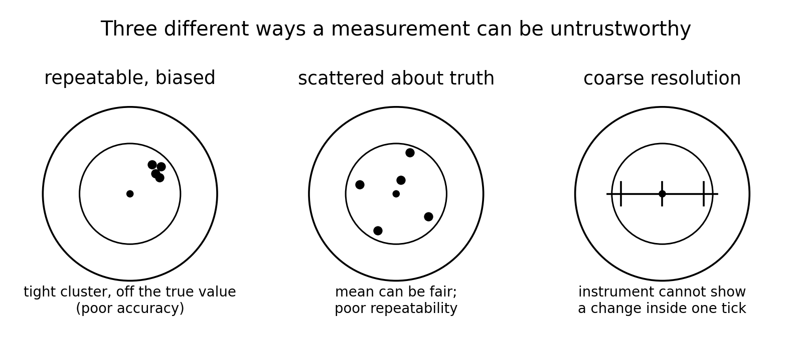
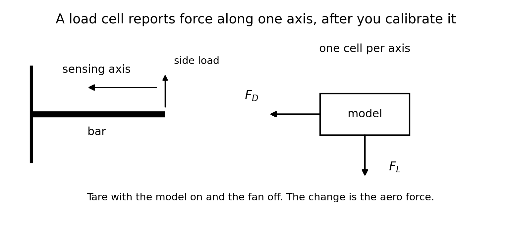
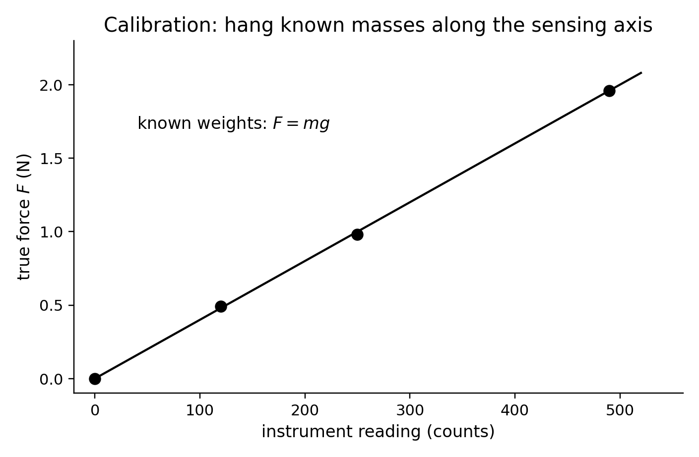
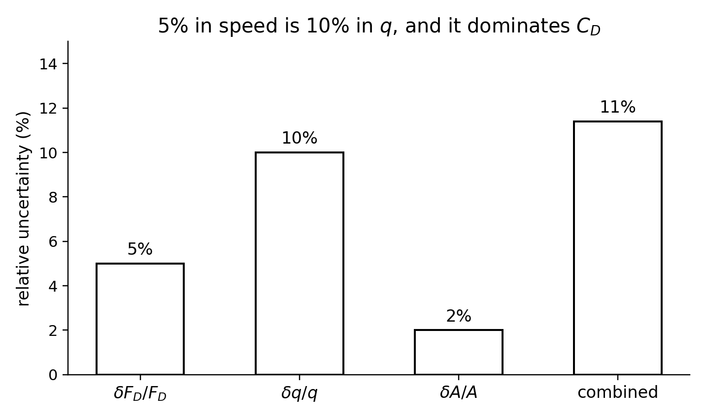

<!--
npx @marp-team/marp-cli curriculum/slides/week-06-lecture.md -o curriculum/slides/week-06-lecture.pdf --allow-local-files
-->

# Week 6
## Test platform, calibration, and uncertainty

**Automotive Aerodynamics Independent Study**  
Industrial Design × Physics (DePaul)

Physics mentor · 10-week IS

---

# Today’s agenda

1. Recap: model forces are about a newton; Re will not match full scale  
2. Resolution, accuracy, repeatability  
3. What a strain-gauge load cell reports  
4. Calibrate with known weights  
5. Why a speed error doubles in $q$  
6. Combine uncertainties in $C_D=F_D/(qA)$  
7. A repeatable run protocol  
8. Deliverables and safety  

---

# Learning targets (by end of Week 6)

You will be able to:

- Distinguish **resolution**, **accuracy**, and **repeatability**
- Explain why the load cell must see aero force along its sensing axis
- Turn a calibration with $F=mg$ into newtons
- Estimate $\delta q/q \approx 2\,\delta v/v$ and a rough uncertainty in $C_D$
- Write a protocol: warm-up, tare, replicates, one variable at a time

---

# Recap — the number the sensor has to see

Week 3 example, $A=0.015\,\mathrm{m^2}$, $v=15\,\mathrm{m/s}$, $C_D=0.45$:

$$
F_D \approx 0.91\,\mathrm{N}
$$

Week 1: a few newtons of downforce on a $\sim 100\,\mathrm{N}$ model weight is a small fraction of $mg$.

Week 5: you will rank configs at model Re. That ranking is real only if the force change is larger than the noise.

Learning outcome LO6: design the experiment so a reported $\Delta C_D$ is not an accident of the fixture.

---

# Three different failures

| Word | Question it answers |
|------|---------------------|
| Resolution | What is the smallest change the instrument can display? |
| Accuracy | How close is that reading to the true force? |
| Repeatability | If I repeat the same run, how tight is the cluster? |

A bathroom scale can be repeatable at the kilogram level and still have no resolution for $0.2\,\mathrm{N}$.  
A sensitive cell can be repeatable and still be **biased** until you calibrate it.

---

# Three pictures of a bad measurement

---

# What the force sensor is

A common lab cell is a metal bar with strain gauges.

The force bends the bar. The foil gauges stretch, and their electrical resistance changes by a fraction of an ohm. A bridge and an amplifier (for example an HX711-class board) turn that tiny change into a count.

You do not interpret the count as pascals. You turn it into **newtons** with a calibration.

The cell is built for **one axis**. A force sideways on that axis shows up as a corrupted reading, not as a clean second component.

---

# Sensing axis

---

# Mount it so aero force is the signal

Week 1’s $12\,\mathrm{kg}$ model has $mg\approx 118\,\mathrm{N}$. A $2.5\,\mathrm{N}$ downforce is about a 2% change in the scale reading.

Do this instead:

- One cell along the flow for $F_D$  
- One cell vertical for $F_L$, if you measure both  
- **Tare** with the model mounted and the fan **off**  
- The change when the fan is on is the aero force  

A cell rated for 5–10 kg, used as a bathroom scale under the tires, is the wrong instrument for a one-newton difference. A cell whose full scale is a few newtons, or a few hundred grams-force, matches this platform.

---

# Calibration is $F=mg$

Hang known masses so the weight pulls **along the sensing axis**.

$$
F = mg
$$

Example: $50\,\mathrm{g}$, $100\,\mathrm{g}$, $200\,\mathrm{g}$ are $0.49\,\mathrm{N}$, $0.98\,\mathrm{N}$, $1.96\,\mathrm{N}$ using $g=9.8\,\mathrm{m/s^2}$.

Plot true force against counts. The slope is the calibration. Check that a zero load is a zero force after tare.

---

# Calibration line

---

# Keep the slope

Document the slope. A later day that drifts needs a new line, not a silent reuse.

---

# You still need speed

$$
C_D = \frac{F_D}{q A}, \qquad q=\tfrac12\rho v^2
$$

A perfect force and a guessed $v$ still make a poor $C_D$.

Ways to get $v$, from better to merely honest:

- Anemometer or a pitot with a differential pressure sensor, in the free stream  
- A fan-setting curve you measured once and recheck  
- “Setting 3” written in the notebook, with $v$ left blank until you measure it  

Blank and honest beats a decorative $q$.

---

# Checkpoint 1 — force

> Force is measured to $\pm 0.05\,\mathrm{N}$, and a typical $F_D$ is $1.0\,\mathrm{N}$. Relative uncertainty in $F_D$?

$$
\frac{\delta F_D}{F_D} = \frac{0.05}{1.0} = 0.05 = 5\%
$$

Five percent of the force. If two wings differ by $0.03\,\mathrm{N}$, this sensor-and-setup combination cannot see it. If they differ by $0.4\,\mathrm{N}$, it can.

---

# Speed errors hit $q$ twice

$$
q = \tfrac12\rho v^2
$$

For a small fractional change $\varepsilon=\delta v/v$,

$$
\frac{\delta q}{q} \approx 2\frac{\delta v}{v}
$$

The 2 is the exponent on $v$.  
Exact check: a speed that is 5% high is a factor $1.05$, and

$$
(1.05)^2 = 1.1025
$$

so $q$ is $10.25\%$ high. The “times two” rule is the right estimate.

---

# Checkpoint 2 — speed

> Speed uncertainty $\pm 5\%$. About what percent uncertainty in $q$, and thus in the coefficient, if everything else is perfect?

$$
\frac{\delta q}{q} \approx 2\times 5\% = 10\%
$$

Because $C_D=F_D/(qA)$, a 10% error in $q$ is a 10% error in $C_D$ when $F_D$ and $A$ are exact.

This is why an unmeasured fan is often the dominant error, even after a careful load-cell calibration.

---

# Combine the pieces

When force, $q$, and area contribute independently, a standard lab combination is

$$
\frac{\delta C_D}{C_D} \sim \sqrt{ \left(\frac{\delta F_D}{F_D}\right)^2 + \left(\frac{\delta q}{q}\right)^2 + \left(\frac{\delta A}{A}\right)^2 }
$$

Same pattern for $C_L$. This is an estimate, not a statistics course. It tells you which term dominates.

---

# Worked budget

Take $\delta F_D/F_D=5\%$, $\delta v/v=5\%$ so $\delta q/q\approx 10\%$, and $\delta A/A=2\%$.

$$
\frac{\delta C_D}{C_D} \sim \sqrt{5^2 + 10^2 + 2^2}\,\% = \sqrt{129}\,\% \approx 11\%
$$

---

# Where the 11% comes from

---

# The speed term dominates

Buying a finer force readout does not fix an unknown $v$.

---

# What counts as a real change

With $\sim 11\%$ uncertainty:

- A 3% shift in $C_D$ between two configs is probably noise  
- A 25% shift is large enough to talk about, if the runs were repeats and the only change was the part  

Compare configs using the **mean of replicates**, and show the spread. Do not rank two single runs that differ by less than the budget.

---

# Checkpoint 3 — why three runs

One run cannot tell fixture drift from a real aero change.

Three or more replicates:

- Let you report a mean  
- Show the spread (range or standard deviation)  
- Catch a blunder: a loose wing, a tare you forgot, a fan that had not settled  

If the three $F_D$ values are $0.80$, $0.84$, $1.40\,\mathrm{N}$, the third point is a problem to explain, not a number to average in silently.

---

# Run protocol

Use this order every time. It matches the lab guide.

1. Inspect the fixture. Clear the intake and the exhaust.  
2. Power the sensors. Let the fan warm up if it needs it.  
3. Mount the config. **Tare with the flow off.**  
4. Set the fan. Wait until the reading settles.  
5. Record for a fixed duration. That is replicate 1.  
6. Repeat for replicates 2 and 3 without changing the part.  
7. Flow off. Check that the tare has not drifted.  
8. Change **one** variable. Repeat.

Write the config ID before you start the fan, not after you like the number.

---

# Noise floor, before any wing debate

Do one session that is only:

- Model on, fan off: tare and the jitter  
- Fan on, no model, or the empty fixture, if that is safe: what the cell does in the breeze  
- Model on, fan on, BASE-00: the first real $F_D$ and $F_L$

If the aero change is smaller than the fan-off jitter, fix the mount, the cell range, or the speed **before** Week 7’s angle sweep.

---

# Keep the other variables still

A wing comparison is invalid if ride height, yaw, or $A$ also moved.

Record, every run, the columns already in the template:

`config_id`, `aoa_deg`, `ride_height_mm`, `fan_setting`, `airspeed_m_s`, `rho_kg_m3`, `ref_area_m2`, `length_L_m`, `F_drag_N`, `F_lift_N`, `replicate`

Temperature in the notes if the day changed: $\rho$ is not exactly $1.2$ on every afternoon. A note is enough until the shift is large.

---

# From counts to coefficients

1. Calibration slope: counts $\to$ newtons  
2. Tare: subtract the fan-off reading  
3. $q=\tfrac12\rho v^2$ with the measured $v$  
4. $C_D=F_D/(qA)$, $C_L=F_L/(qA)$, using the frozen $A$  
5. $\mathrm{Re}=v L/\nu$ with the frozen $L$  
6. Mean and spread across replicates  

`tools/compute_coefficients.py` does steps 3–5 from the CSV. It does not know your calibration or your tare. Those stay in the notebook.

---

# Safety

- Eye protection at the fan  
- No loose hair, clothing, or jewelry near the intake  
- Wings and the model secured: a part that lets go is a projectile  
- Electrical safety on the sensor supply (GFCI where you have it)  
- Do not put your hand in the stream to “feel the force” during a logged run  

The protocol one-pager includes these lines, not only the button order.

---

# Physics checkpoint (full)

1. $\delta F_D/F_D=5\%$.  
2. $\delta q/q\approx 10\%$, so $C_D$ moves by about 10% from speed alone.  
3. Three replicates give a mean, a spread, and a chance to see a bad run. Two configs closer than the uncertainty are not a ranking.

---

# Design / build tasks this week

- [ ] Finish the fixture: alignment, AoA stops, fan secured  
- [ ] Calibration table: masses, $F=mg$, counts, slope  
- [ ] Airspeed vs fan setting, or a written plan to measure $v$  
- [ ] One noise-floor session: tare, fan off, and BASE-00  
- [ ] Protocol one-pager  

---

# Deliverables checklist

| Deliverable | Where |
|-------------|--------|
| Protocol one-pager | notes, and the checklist in [`labs/README.md`](../../labs/README.md) |
| Calibration table or plot | lab notebook |
| Noise-floor notes | lab notebook; first CSV rows if you are ready |

Due before Week 7’s angle sweep. An uncalibrated count is not a $C_L$.

---

# How you will be assessed on Week 6

**Strong:** tare described; calibration in newtons; uncertainty that notices the $v^2$; replicates; one variable changed.  
**Weak:** “the sensor said 400” with no slope; a $C_D$ from an unmeasured speed; a single run treated as exact; aero force inferred by subtracting $mg$ from a coarse scale.

---

# Looking ahead — Week 7

Angle of attack. You will sweep the wing and watch $C_L$ and $C_D$, including the qualitative idea of stall (Week 4’s separated flow, now as a measurement).

The AoA stop and the calibration have to exist before that sweep means anything.

---

# Instructor talking points

- Ask which axis the cell measures before discussing wing shapes.  
- If $v$ is only a fan knob, make $\delta q/q$ the lead uncertainty, not a footnote.  
- A 100 g or 500 g cell is in the right neighborhood for $\sim 1\,\mathrm{N}$; a body-weight scale is not.  
- Do not let Week 7 start on an untared fixture.

---

# References for this lecture

- Course note: [`physics/06-uncertainty-basics.md`](../../physics/06-uncertainty-basics.md)  
- Week plan: [`curriculum/week-06-test-platform.md`](../week-06-test-platform.md)  
- Lab protocol and CSV: [`labs/README.md`](../../labs/README.md), [`labs/data-template.csv`](../../labs/data-template.csv)  
- Optional hardware reading on strain-gauge cells: [SparkFun, Getting Started with Load Cells](https://learn.sparkfun.com/tutorials/getting-started-with-load-cells)  
- Figures: [`curriculum/slides/figures/`](figures/)

---

# End of Week 6 lecture

**Next actions**

1. Calibrate along the sensing axis and write the slope  
2. Tare, then record a noise floor  
3. Put $v$ or a fan curve in the notebook  
4. One-pager protocol before the first AoA sweep  

Questions?
