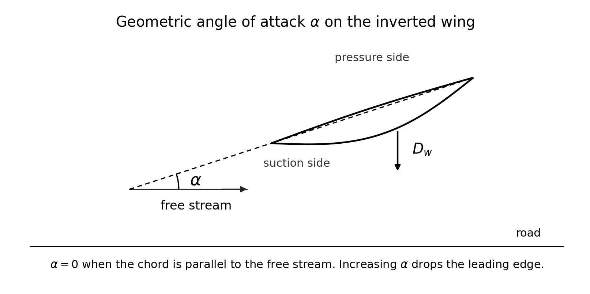
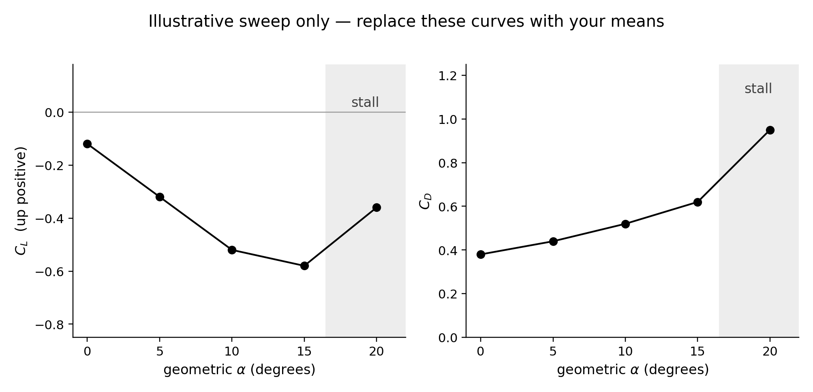
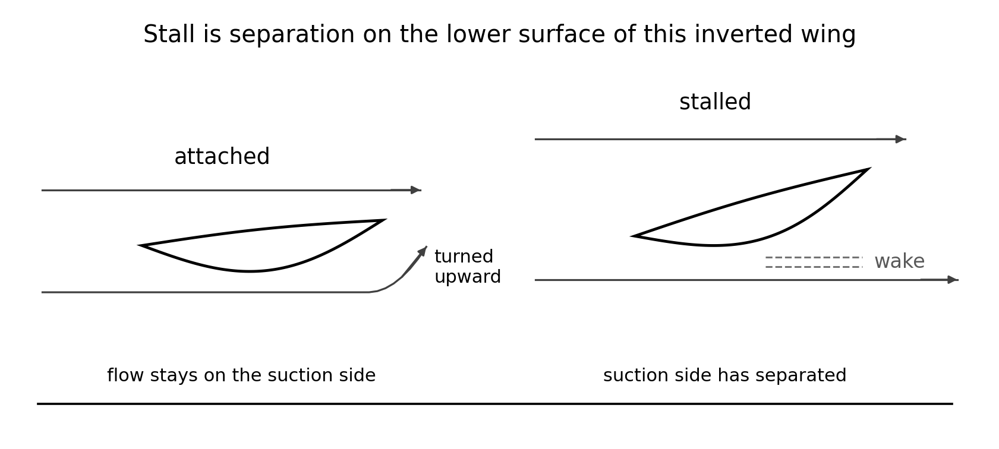
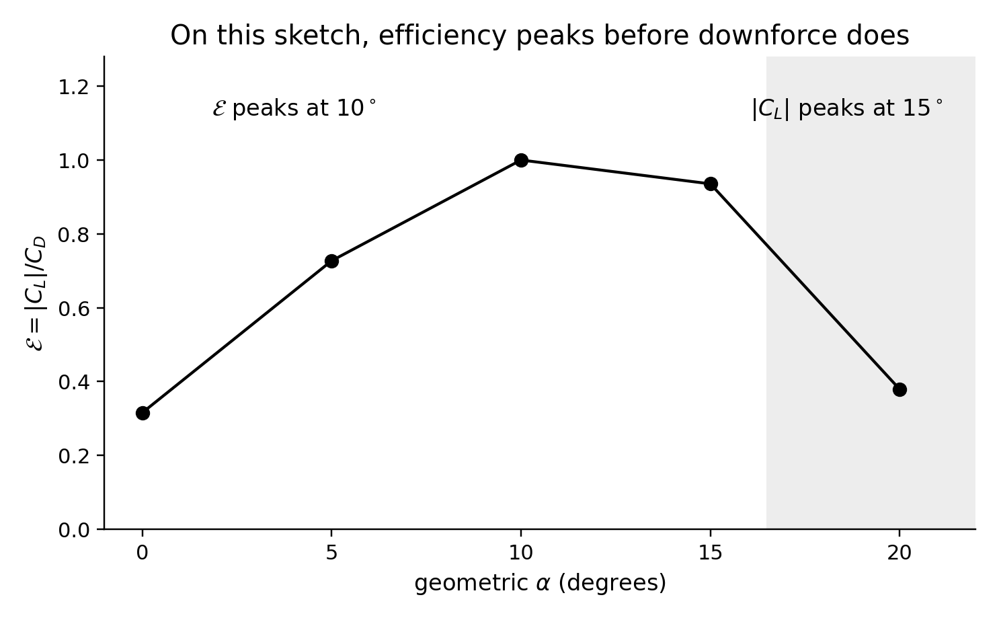

<!--
npx @marp-team/marp-cli curriculum/slides/week-07-lecture.md -o curriculum/slides/week-07-lecture.pdf --allow-local-files
-->

# Week 7
## Wings, angle of attack, and stall

**Automotive Aerodynamics Independent Study**  
Industrial Design × Physics (DePaul)

Physics mentor · 10-week IS

---

# Today’s agenda

1. Geometric angle of attack, and which way is positive  
2. What $C_L$ and $C_D$ do while the flow stays attached  
3. Stall as separation on the suction side  
4. Why peak downforce and peak efficiency are different angles  
5. The AoA sweep: one fan setting, labeled detents, three replicates  
6. Deliverables  

---

# Learning targets (by end of Week 7)

You will be able to:

- Define geometric $\alpha$ for the modular wing and record the zero  
- Sketch $C_L(\alpha)$ and $C_D(\alpha)$, including a stall region  
- Explain why a race wing is often run nearer stall than an airliner  
- Compute how $\mathcal{E}=|C_L|/C_D$ moves when downforce and drag rise by different fractions  
- Plot means from a real sweep at fixed fan setting  

---

# Recap — what the sweep is allowed to change

Week 3: $F_L = q C_L A$, with $C_L$ up-positive. Downforce is $C_L<0$, and $D_w=-F_L$.

Week 4: a stalled surface is a wake. Bernoulli along that surface is the wrong story.

Week 6: tare, calibration in newtons, and a speed error that doubles in $q$. An angle sweep is meaningless if $\alpha$ is unlabeled or the tare drifted.

This week changes **only** the wing angle. Ride height, $A$, and the fan setting stay put.

---

# Geometric angle of attack

$\alpha$ is the angle between the **chord** and the **free stream**.

The chord is the straight line from the leading edge to the trailing edge. It is not the camber line.

$$
\alpha = 0
$$

when that chord is parallel to the free stream.

On this inverted wing, **increasing $\alpha$ drops the leading edge**. The wing is set to throw air upward. The reaction on the wing is downforce.

If your drawing instead measures $\alpha$ from the body reference line, write that once and use it for every run. Do not mix the two zeros.

---

# The angle, on the wing

---

# Freeze the zero on the part

Before the first logged run:

- Mark the detent that makes the chord parallel to the free stream. That mark is $0^\circ$.  
- Increasing detent numbers drop the leading edge. Photograph that convention once.  
- The course sweep is $0^\circ$, $5^\circ$, $10^\circ$, $15^\circ$. Add $20^\circ$ if the fixture has the stop and you want to see past the peak.  
- Record `aoa_deg` in the CSV. A render with no angle is not a data point.

The suction side of this wing is the **lower** surface. Stall, when it comes, is separation there, not on the top surface of an airplane sketch.

---

# While the flow stays attached

Raising $\alpha$ turns the stream upward more. $|C_L|$ rises, so $C_L$ becomes more negative.

$C_D$ rises too, even before a full stall. A finite wing that makes more downforce leaves stronger trailing vortices. A useful sketch of that cost, while the flow is still attached, is

$$
C_D \approx C_{D0} + k C_L^2
$$

$C_{D0}$ is the drag at zero lift. $k$ is a number you do not need to derive. The point is the shape: drag grows with the square of lift before the wake takes over.

A two-dimensional thin-wing idealization rises about $0.1$ in $C_L$ per degree. Your finite wing, at model Re, on a body, will be less steep. The sweep replaces that idealization.

---

# An illustrative sweep — not your wing

Same $q$ and the frozen $A$ at every angle. The numbers are a teaching sketch.

| $\alpha$ | $C_L$ | $C_D$ | $\mathcal{E}=\|C_L\|/C_D$ |
|----------|-------|-------|---------------------------|
| $0^\circ$ | $-0.12$ | $0.38$ | $0.32$ |
| $5^\circ$ | $-0.32$ | $0.44$ | $0.73$ |
| $10^\circ$ | $-0.52$ | $0.52$ | $1.00$ |
| $15^\circ$ | $-0.58$ | $0.62$ | $0.94$ |
| $20^\circ$ | $-0.36$ | $0.95$ | $0.38$ |

$|C_L|$ peaks at $15^\circ$. $\mathcal{E}$ peaks at $10^\circ$. At $20^\circ$ the wing has stalled: downforce fell and drag jumped.

---

# The same sketch as curves

---

# How to read those curves

$C_L$ is up-positive, so the useful wing sits **below** zero. More downforce is a lower point, until stall.

The gray band is the stall region in this sketch: past the peak, $C_L$ moves back toward zero and $C_D$ stops its slow climb and jumps.

From $0^\circ$ to $10^\circ$ in the table, $C_D$ follows the attached sketch. Take $C_{D0}=0.38$ and $k=0.5$:

$$
C_{D0} + k C_L^2 = 0.38 + 0.5(0.52)^2 = 0.52
$$

which matches the $10^\circ$ row. At $20^\circ$ the same formula gives about $0.44$, but the table has $0.95$. The extra is the separated wake, not the $C_L^2$ term.

---

# Attached turning, and stall

---

# What that picture is claiming

**Attached:** the stream leaves turned upward. Downforce is the reaction. Week 4’s “if attached” still applies.

**Stalled:** the lower surface has separated. The exit is not turned upward. Dashed lines mark the wake. $|C_L|$ falls, $C_D$ rises.

This is a sketch, not a simulation. The gap between the lines and the wing is there so the lines stay outside the solid. Your tufts, if you use them, go on the **lower** surface.

---

# Checkpoint 1 — the sketch you owe

Sketch $C_L(\alpha)$ and $C_D(\alpha)$ for a simple cambered wing before you trust the fan.

Mark:

- $C_L$ negative if the wing makes downforce  
- a rise in $|C_L|$ while attached  
- a peak, then a stall region where $|C_L|$ drops or stops rising  
- $C_D$ climbing through the attached range and jumping in the stall region  

Your measured curves replace this sketch. They do not have to match the table.

---

# Efficiency peaks earlier than downforce

---

# Checkpoint 3 — 40% more downforce, 80% more drag

$\mathcal{E}=|F_L|/F_D$ using the same $A$. Both forces scale, so the new ratio is

$$
\frac{\mathcal{E}_2}{\mathcal{E}_1} = \frac{1.40}{1.80} = 0.78
$$

$\mathcal{E}$ falls to about 78% of its previous value. Downforce went up. The downforce-to-drag ratio went down.

A numerical example with the same fractions:

| | $\|F_L\|$ | $F_D$ | $\mathcal{E}$ |
|--|-----------|-------|----------------|
| before | $1.00\,\mathrm{N}$ | $0.80\,\mathrm{N}$ | $1.25$ |
| after | $1.40\,\mathrm{N}$ | $1.44\,\mathrm{N}$ | $0.97$ |

Whether “after” is the better design depends on the Week 1 rule. If the rule is maximum $\mathcal{E}$, this change lost. If the rule is more downforce and drag is uncapped, it won.

---

# Checkpoint 2 — why the wing looks “too aggressive”

An airliner in cruise wants range. That favors a high lift-to-drag ratio at a modest angle, well short of stall.

The wing on this car is there to raise the normal force (Week 1) at the speed you test. The useful stop is often near the **peak of $|C_L|$**, where $\mathcal{E}$ has already started to fall and $C_D$ is already climbing.

“Too aggressive” relative to cruise is the goal, up to the stall. Past the stall you lose downforce and pay a drag jump. You do not get both.

---

# Low Re can move the peak

Week 5: separation depends on Re. A wing that would still be attached at full scale can stall on the model at a smaller $\alpha$.

If your $|C_L|$ peaks at $8^\circ$ when you expected $15^\circ$, that can be the Reynolds-number result, not a broken print.

Say so in the interpretation. Do not “correct” the curve into a full-scale stall angle you did not measure.

---

# Forces for the sketch, so the sensor has a scale

Week 3’s $q=135\,\mathrm{Pa}$ and $A=0.015\,\mathrm{m^2}$ give $qA=2.03\,\mathrm{N}$.

At the sketch’s $15^\circ$ peak:

$$
F_L = (135)(-0.58)(0.015) = -1.17\,\mathrm{N}
$$

$$
F_D = (135)(0.62)(0.015) = 1.26\,\mathrm{N}
$$

About a newton of downforce and a newton of drag. Week 6’s cell has to resolve a **change** of a few tenths of a newton between detents, not the model’s weight.

---

# The run

One fan setting for the whole sweep. Then $q$ is the same number and a change in $F_L$ is a change in $C_L$.

If the anemometer says $v$ moved, recompute $q$. Do not compare raw newtons from two different speeds.

For each detent:

1. Set the stop. Read the angle. Do not guess.  
2. Tare check: fan off, model on, as in the Week 6 protocol.  
3. Fan on, settle, record.  
4. Three replicates before the next detent.  
5. One variable only. If the wing swap also changed ride height, the run is not an AoA sweep.

---

# What you plot

From the CSV, for each $\alpha$:

- Mean $C_L$ and mean $C_D$  
- The spread of the three replicates (the range, or a simple error bar)  
- $\mathcal{E}$ if your Week 1 metric uses it  

Caption the plot with $v$ or Re, the frozen $A$, and the config id. Title it with the wing name, not “results.”

Mark the angle of largest $|C_L|$ and the angle of largest $\mathcal{E}$. They are allowed to differ. The stall call is the region where $|C_L|$ stops rising **and** $C_D$ jumps, by more than the replicate spread.

---

# A wiggle is not a stall

Week 6’s worked budget was about 11% on $C_D$ when speed dominated. A 3% move between two detents is smaller than that budget.

Call stall only when the drop in $|C_L|$, or the jump in $C_D$, is larger than the spread you actually got from the three replicates.

If two neighboring angles overlap inside that spread, write “not resolved,” not a story about a peak.

---

# Optional: tufts

Short yarn tufts on the **lower** surface, taped so they can stream.

Attached: they lie along the surface. Separated: they flutter or point upstream.

Smoke or incense is optional and easy to do badly. No open flame near the fan, the plastic, or the sensor wiring. If you cannot do it without a flame in the stream, skip it. The force curve is the measurement. Tufts are a picture of the same fact.

---

# Physics checkpoint (full)

1. Sketch: $C_L$ negative and growing in magnitude, then a stall region; $C_D$ rising, then a jump.  
2. Cruise optimizes lift-to-drag far from stall. This wing is allowed to sit near peak $|C_L|$ because the job is normal force. Past stall, both goals get worse.  
3. $\mathcal{E}$ falls to $1.40/1.80 \approx 0.78$ of its old value. More downforce, worse efficiency, until the Week 1 rule picks a winner.

---

# Design / build tasks this week

- [ ] Detents labeled, zero defined, leading-edge-down direction photographed  
- [ ] Sweep at one fan setting, $\ge 3$ replicates at each angle  
- [ ] CSV rows with `aoa_deg` filled in  
- [ ] Plot of mean $C_L$ and $C_D$ versus $\alpha$, with the replicate spread  
- [ ] Half-page interpretation: where $|C_L|$ peaked, where $\mathcal{E}$ peaked, whether you saw stall  

---

# Deliverables checklist

| Deliverable | Where |
|-------------|--------|
| Sweep CSV | `data/processed/` using [`labs/data-template.csv`](../../labs/data-template.csv) |
| $C_L$, $C_D$ versus $\alpha$ | notes or the Week 7 folder |
| Interpretation, ½–1 page | notes |

Due before Week 8 changes the underbody. Leave the wing at the angle you will freeze for those tests, and write that angle down.

---

# How you will be assessed on Week 7

**Strong:** $\alpha=0$ defined; $C_L$ sign correct; stall described as separation; $\mathcal{E}$ computed when downforce and drag both move; plot uses means and the same $q$.  
**Weak:** “more angle is always more downforce”; a stall call smaller than the replicate spread; newtons compared across two fan settings; an airplane upper-surface stall story pasted onto this inverted wing.

---

# Looking ahead — Week 8

The wing angle you picked stays fixed. Week 8 changes the underbody: splitter, diffuser, ride height.

You will answer a puzzle the Week 4 diffuser cartoon left open: pressure **rises** along an attached diffuser, and the car can still make downforce, because the low pressure is under the floor ahead of that recovery.

---

# Instructor talking points

- Ask which surface is the suction side before looking at the plot.  
- If $|C_L|$ peaks early, send them to the Week 5 Re disclaimer rather than to a reprint.  
- Do not let a single noisy $15^\circ$ point become “the stall angle.”  
- Freeze the angle in writing before Week 8, or the underbody test is a second AoA test.

---

# References for this lecture

- Course note: [`physics/07-wings-and-aoa.md`](../../physics/07-wings-and-aoa.md)  
- Week plan: [`curriculum/week-07-wings-and-aoa.md`](../week-07-wings-and-aoa.md)  
- Signs and $\mathcal{E}$: [`physics/03-drag-and-lift.md`](../../physics/03-drag-and-lift.md)  
- Separation: [`physics/04-bernoulli-and-limits.md`](../../physics/04-bernoulli-and-limits.md)  
- Lab CSV: [`labs/data-template.csv`](../../labs/data-template.csv)  
- Figures: [`curriculum/slides/figures/`](figures/)

---

# End of Week 7 lecture

**Next actions**

1. Define and photograph $\alpha = 0$  
2. Run the detent sweep, three replicates, one fan setting  
3. Plot means, and mark peak $|C_L|$ and peak $\mathcal{E}$ separately  
4. Write which angle stays on the car for Week 8  

Questions?
