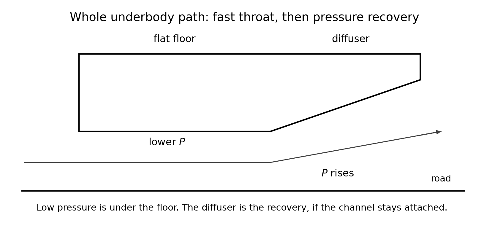
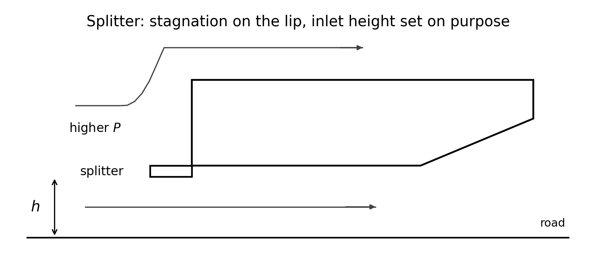
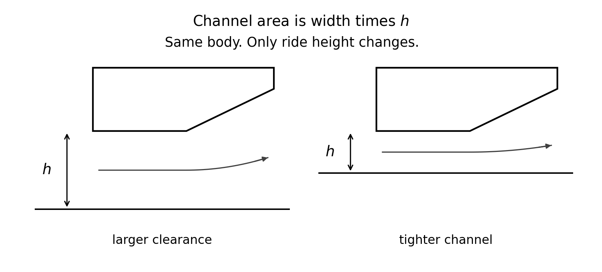
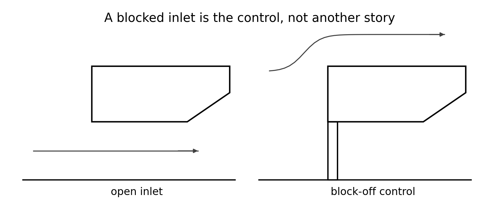

<!--
npx @marp-team/marp-cli curriculum/slides/week-08-lecture.md -o curriculum/slides/week-08-lecture.pdf --allow-local-files
-->

# Week 8
## Splitters, diffusers, and ride height

**Automotive Aerodynamics Independent Study**  
Industrial Design × Physics (DePaul)

Physics mentor · 10-week IS

---

# Today’s agenda

1. The underbody is one path, not one slogan  
2. Why pressure can rise in the diffuser and the floor can still make downforce  
3. The splitter sets an inlet height, and a stagnation load  
4. Why a few millimeters of ride height move $A$ and $\Delta P$  
5. A block-off plate as the control  
6. What to measure so “more downforce” is not just “more drag”  

---

# Learning targets (by end of Week 8)

You will be able to:

- Trace the underbody path: inlet, fast throat, recovery at the diffuser  
- Explain that low pressure belongs on the floor, and the pressure rise belongs on the ramp, **if attached**  
- Show why channel area $A=bh$ makes ride height a first-order variable  
- Compare at least two underbody configs with the wing and the fan fixed  
- Name a metric that separates extra downforce from extra drag  

---

# Recap — the ideal sign, and the condition

Week 4: an attached diffuser slows the stream as the area grows, and

$$
P + \tfrac12\rho v^2 \approx \mathrm{const}
$$

along that streamline. Speed down, pressure up. That rise is **pressure recovery**.

Week 7 froze a wing angle. This week does not move it. The new variable is the underbody, one change at a time.

A separated ramp is a wake. Then this pressure story is a hypothesis you have not earned.

---

# The puzzle in checkpoint 1

If the diffuser **slows** the air and the pressure **rises** toward the exit, how can low pressure under the car still be the source of downforce?

The diffuser is only the rear of the path. The low pressure is not “in the recovery.” It is upstream, where the channel is tight and the air is fast.

---

# The whole path

---

# Read the path from front to back

1. Air that gets under the nose is in a channel: body above, road below.  
2. Ahead of the ramp the floor is the **throat**. Area is small, so the speed is high **if** this air is feeding a larger exit.  
3. High speed, attached streamline: pressure at the throat is low. That low pressure on the floor area is downforce.  
4. Along the diffuser the area grows, the speed falls, and $P$ climbs back toward the exit. Recovery is the climb. It is not a second region of suction.

Low $P$ and rising $P$ are two stations on one path. They are not a contradiction.

---

# Worked stations — teaching numbers

Model underbody width $b=0.12\,\mathrm{m}$. Throat height $h_1=15\,\mathrm{mm}$. Exit height $h_2=30\,\mathrm{mm}$.

$$
A_1 = (0.12)(0.015) = 0.0018\,\mathrm{m^2}, \qquad A_2 = 0.0036\,\mathrm{m^2}
$$

Assume the exit speed is $10\,\mathrm{m/s}$ and the channel stays attached. Continuity:

$$
v_1 = v_2\frac{A_2}{A_1} = 20\,\mathrm{m/s}
$$

Bernoulli, $\rho=1.2\,\mathrm{kg/m^3}$, throat relative to the exit:

$$
P_1 - P_2 = \tfrac12\rho(v_2^2 - v_1^2) = 0.6(100-400) = -180\,\mathrm{Pa}
$$

The floor is $180\,\mathrm{Pa}$ below the exit. The ramp is where those $180\,\mathrm{Pa}$ are recovered. Same arithmetic as Week 4, now located on the car.

---

# What those assumptions are doing

The $-180\,\mathrm{Pa}$ used:

- incompressible continuity, $A_1 v_1 = A_2 v_2$  
- one attached streamline from throat to exit  
- an exit speed we **chose** ($10\,\mathrm{m/s}$), not one you measured  
- no air leaking out the sides of the channel  

Change any of those and the number moves. A fraction of $180\,\mathrm{Pa}$ on a small floor is still a newton-scale force: $180\,\mathrm{Pa}\times 0.010\,\mathrm{m^2} = 1.8\,\mathrm{N}$. That is why the sensor might see ride height. It is not a prediction of your $C_L$.

---

# The splitter

---

# Two jobs, both hypotheses until you measure

**Inlet height.** The lip sets how much gap the underbody is offered. That gap is $h$ in $A=bh$ at the front of the channel. Less $h$ is not automatically “more downforce.” Too little and the channel can separate or starve.

**Stagnation on the lip.** Air that stops on the upper face of the splitter is at higher $P$. That patch pushes **down on the splitter**. It is a local load, separate from the low pressure under the floor.

Week 2 drew this as a pressure sketch. This week you can test it: splitter on and off, at the same ride height, wing fixed.

---

# Ride height is the channel height

For a rectangular channel, $A=bh$. Width $b$ is the body. Height $h$ is the clearance you set with the fixture.

At the $15\,\mathrm{mm}$ throat above, $A_1=0.0018\,\mathrm{m^2}$. Raise the throat to $20\,\mathrm{mm}$ and keep the exit at $30\,\mathrm{mm}$:

$$
A_1' = (0.12)(0.020) = 0.0024\,\mathrm{m^2}
$$

$$
v_1' = 10\times\frac{0.0036}{0.0024} = 15\,\mathrm{m/s}
$$

$$
P_1' - P_2 = 0.6(100 - 225) = -75\,\mathrm{Pa}
$$

Same exit-speed assumption. The suction at the throat fell from $180\,\mathrm{Pa}$ to $75\,\mathrm{Pa}$ because $h$ grew by $5\,\mathrm{mm}$. Five millimeters is a third of $15\,\mathrm{mm}$, and area moved with it.

---

# Checkpoint 2 — why clearance is not a detail

Three different failures, all from $h$:

1. **Area.** $A\propto h$, so throat speed and $\Delta P$ move when $h$ moves a few millimeters, as in the $15\to 20\,\mathrm{mm}$ estimate.  
2. **Too much gap.** The road stops being a wall of the channel. Air spills sideways. Continuity between a throat and an exit stops being the right picture.  
3. **Too little gap, or a steep ramp.** The diffuser angle that was gentle at one $h$ separates at another. Week 4’s kink. Recovery fails, and the low-pressure floor can go with it.

Photograph $h$ with a scale in the frame. “About the same ride height” is not a number.

---

# Ground effect, said narrowly

Proximity to the road is what makes the underbody a channel instead of a free wing. That is the ground-effect idea this course uses.

There is no extra formula this week for “ground effect multiplies $C_L$ by …” The measurement is the ride-height sweep: same parts, two or three values of $h$, both $F_L$ and $F_D$.

If $|F_L|$ changes a lot when $h$ changes a little, the underbody path is real on your fixture. If it does not, the channel story is not what your sensor is seeing, and you say that.

---

# The control is a closed inlet

A block-off plate fills the inlet so the underbody is not a channel. The body, the wing, the fan, and the ride height stay the same.

If downforce drops when you close the inlet, the open channel was doing work. If it does not, the signal was somewhere else (the wing you froze, the splitter’s stagnation patch, or a tare problem). Either result is a result.

---

# Checkpoint 3 — downforce versus drag

“More downforce” with an unstated drag change is the Week 7 trap again.

At the same fan setting, report all three:

| Quantity | What it tells you |
|----------|-------------------|
| $F_L$ or $C_L$ | Did the vertical force change? |
| $F_D$ or $C_D$ | What did that change cost in drag? |
| $\mathcal{E}=\|C_L\|/C_D$ | Did the ratio improve? |

A config that raises $|C_L|$ and lowers $\mathcal{E}$ is not a free upgrade. Your Week 1 metric decides whether you keep it.

---

# The comparison you owe

Wing angle frozen. Fan setting frozen. $A$ and $L$ are the ones you already froze.

| Config | What changed |
|--------|----------------|
| BASE | flat underbody, the reference |
| SPLIT | splitter only |
| DIFF | diffuser only |
| BOTH | splitter and diffuser |

BOTH is a fourth corner. It is not the sum of SPLIT and DIFF. Week 9 is about that fact. Measure it now; interpret the interaction next week.

Optional fifth row: block-off at the same $h$.

Three replicates each. Record `ride_height_mm` on every row. If $h$ moved when you bolted the diffuser on, you changed two variables.

---

# A paragraph that is not a slogan

Write the interpretation in this order:

1. What you held fixed (wing $\alpha$, fan, $A$).  
2. What $h$ was, with the photo.  
3. What happened to $C_L$ and to $C_D$, means and spread.  
4. One sentence on attachment: you do not claim recovery unless something (the force, or tufts on the ramp) says the ramp stayed attached.  

Forbidden as a conclusion: “the diffuser speeds the air up under the car, so pressure is low.” That sentence skips the throat, puts the low pressure in the wrong place, and forgets stall.

---

# Physics checkpoint (full)

1. Low $P$ is at the fast throat, under the flat floor. The diffuser is the recovery: $P$ rises toward the exit if the ramp stays attached. Both can be true on one path.  
2. $A=bh$, so a few millimeters are a large fraction of $h$. Too much gap and the channel assumption dies; too little, or too steep, and the ramp separates.  
3. Report $C_L$ and $C_D$, or $\mathcal{E}$, at the same $q$. A downforce gain with a larger drag gain is not automatically the better config.

---

# Design / build tasks this week

- [ ] Splitter and diffuser, or a block-off if a shape is not ready  
- [ ] Wing at the frozen Week 7 angle  
- [ ] Ride height measured and in the photo  
- [ ] Table: BASE, and at least one other underbody, both forces  
- [ ] Interpretation paragraph with the attachment caveat  

---

# Deliverables checklist

| Deliverable | Where |
|-------------|--------|
| Config photos with a scale for $h$ | notes or `cad/` |
| Comparison table | lab notebook and the CSV |
| Interpretation paragraph | notes |

Due before the Week 9 matrix treats BOTH as an interaction instead of as a vibe.

---

# How you will be assessed on Week 8

**Strong:** throat versus recovery in the right order; $h$ as a measured length; wing and fan fixed; both force components reported; “if attached” still in the sentence.  
**Weak:** “diffuser = low pressure” with no path; ride height absent; a drag increase described only as more grip; BOTH assumed equal to SPLIT plus DIFF.

---

# Looking ahead — Week 9

You will test whether the solo $\Delta F_z$ values add. They often do not. A wing changes the air the diffuser sees, and a diffuser changes the air the wing sees.

The Week 1 decision rule has to be written down before you pick a champion, or the matrix will pick the rule for you.

---

# Instructor talking points

- If the student says “low pressure in the diffuser,” ask which station.  
- Reward a null ride-height result that is cleanly measured.  
- Do not accept a diffuser conclusion from a run that also moved $\alpha$ or $h$.  
- BOTH can be logged this week and interpreted next week. Do not require a superposition story yet.

---

# References for this lecture

- Course note: [`physics/08-underbody.md`](../../physics/08-underbody.md)  
- Week plan: [`curriculum/week-08-underbody-diffuser.md`](../week-08-underbody-diffuser.md)  
- Diffuser limits: [`physics/04-bernoulli-and-limits.md`](../../physics/04-bernoulli-and-limits.md)  
- Lab protocol: [`labs/README.md`](../../labs/README.md)  
- Figures: [`curriculum/slides/figures/`](figures/)

---

# End of Week 8 lecture

**Next actions**

1. Freeze the Week 7 wing angle in the notebook  
2. Measure $h$ and photograph it  
3. Run BASE and at least one underbody change, three replicates  
4. Write $C_L$, $C_D$, and one sentence that keeps recovery conditional  

Questions?
