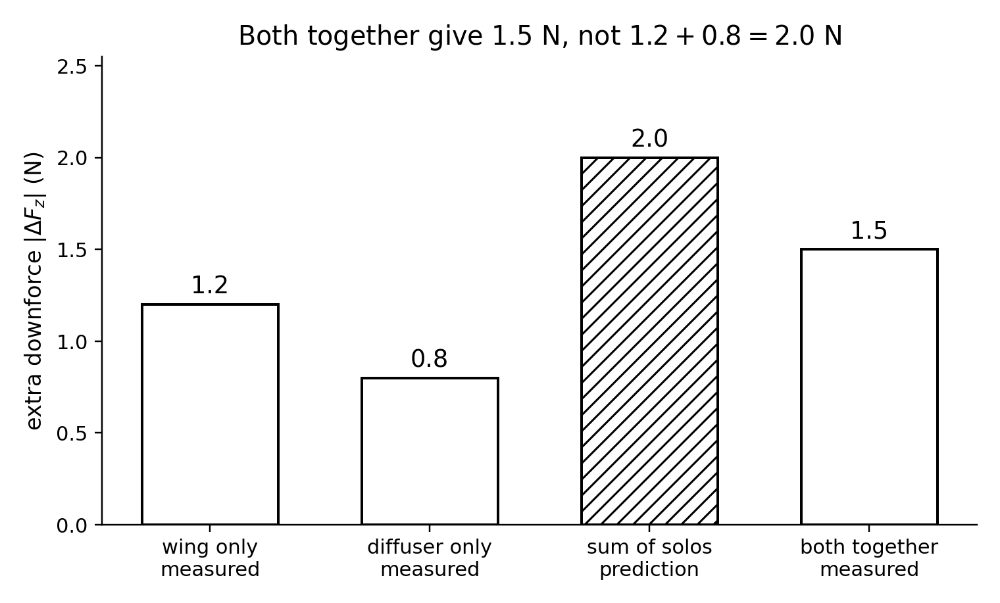

<!--
npx @marp-team/marp-cli curriculum/slides/week-09-lecture.md -o curriculum/slides/week-09-lecture.pdf --allow-local-files
-->

# Week 9
## Combined configs and interactions

**Automotive Aerodynamics Independent Study**  
Industrial Design × Physics (DePaul)

Physics mentor · 10-week IS

---

# Today’s agenda

1. A 2×2 matrix is the smallest interaction test  
2. Worked numbers: the solos do not add  
3. When a residual is physics, and when it is the fixture  
4. A decision rule written before the champion is chosen  
5. What still has to be true about $q$, $A$, and Re  

---

# Learning targets (by end of Week 9)

You will be able to:

- Compute an interaction residual from baseline, part A, part B, and A+B  
- Say what a non-zero residual implies about the flow, and what else could fake it  
- Apply an explicit Week 1 rule to pick one champion  
- Keep the claim at model Re, with the Week 6 uncertainty in the sentence  

---

# Recap — solos are not a package

Week 7 gave you a wing angle. Week 8 gave you underbody changes, including a BOTH row you were told not to treat as a sum.

“More aero parts are always better” is the design version of the same mistake. Parts share one stream. Each one changes the inflow the other was measured in.

The test is the fourth corner. If you never run BOTH, you cannot claim the sum.

---

# The minimum matrix

| | no diffuser | diffuser |
|--|-------------|----------|
| no wing change | BASE | DIFF |
| wing at the frozen $\alpha$ | WING | BOTH |

Four cells. Three replicates. Twelve runs, plus one repeat of BASE at the end to see whether the tare or the fan drifted.

A third factor (splitter on and off as well) is eight cells and twenty-four runs. Finish the 2×2 before you add it.

Same fan setting, same $h$, same frozen $A$. If BOTH only fits when you raise the ride height, the interaction is confounded with $h$.

---

# Checkpoint 1 — the forces

From the week plan, changes in vertical force relative to baseline. Up-positive, so a negative change is more downforce.

$$
\Delta F_z^{\mathrm{wing}} = -1.2\,\mathrm{N}, \qquad
\Delta F_z^{\mathrm{diff}} = -0.8\,\mathrm{N}, \qquad
\Delta F_z^{\mathrm{both}} = -1.5\,\mathrm{N}
$$

Additivity would predict

$$
\Delta F_z^{\mathrm{wing}} + \Delta F_z^{\mathrm{diff}} = -2.0\,\mathrm{N}
$$

The pair produced $-1.5\,\mathrm{N}$, not $-2.0\,\mathrm{N}$.

$$
\text{residual} = -1.5 - (-2.0) = +0.5\,\mathrm{N}
$$

The residual is positive in the up-positive sign: **$0.5\,\mathrm{N}$ less downforce** than adding the solos. The effects are not additive.

---

# The same fact as bars

The hatched bar was never a run. It is $1.2+0.8$. The measured pair is the $1.5\,\mathrm{N}$ bar.

---

# What a residual can mean

The wing’s wake, or the angle it sets in the stream, is part of the air the diffuser sees. Measured alone, the diffuser had a different inflow.

The diffuser changes pressure and speed upstream of a rear wing. Measured alone, the wing had a different inflow.

So each solo $\Delta F_z$ already includes a flow the other part will erase or reshape. Adding them double-counts a situation that cannot occur when both are mounted.

That is an interaction. It is ordinary. It is not a failed experiment, provided the four cells really changed only the parts.

---

# A full lecture example, still not your data

Baseline aero force $F_z=-0.30\,\mathrm{N}$, $F_D=0.90\,\mathrm{N}$. The checkpoint deltas sit on top of that baseline. Drag numbers are the lecture’s, so the rule has something to decide.

| Config | $F_z$ (N) | $F_D$ (N) | $\Delta F_z$ | $\mathcal{E}$ |
|--------|-----------|-----------|--------------|----------------|
| BASE | $-0.30$ | $0.90$ | $0$ | $0.33$ |
| WING | $-1.50$ | $1.25$ | $-1.20$ | $1.20$ |
| DIFF | $-1.10$ | $1.05$ | $-0.80$ | $1.05$ |
| BOTH | $-1.80$ | $1.50$ | $-1.50$ | $1.20$ |

Drag deltas from BASE: wing $+0.35\,\mathrm{N}$, diffuser $+0.15\,\mathrm{N}$, sum $+0.50\,\mathrm{N}$, both $+0.60\,\mathrm{N}$.

Downforce came up $0.5\,\mathrm{N}$ short of the sum. Drag came up $0.10\,\mathrm{N}$ over the sum. The parts fought on both components.

---

# Same $q$, so the residual is a $\Delta C_L$

Week 3’s $q=135\,\mathrm{Pa}$ and $A=0.015\,\mathrm{m^2}$ give $qA=2.03\,\mathrm{N}$.

$$
\Delta C_L = \frac{\Delta F_z}{qA}
$$

The $0.50\,\mathrm{N}$ residual is

$$
\Delta C_L \approx \frac{0.50}{2.03} = 0.25
$$

in the up-positive coefficient. That is a large miss relative to additivity, **if** every cell used this same $q$ and $A$.

If the fan slowed down when BOTH blocked the stream, part of the $0.50\,\mathrm{N}$ is a speed change. Convert each cell with its own $v$ before you call the residual an interaction.

---

# Checkpoint 3 — a residual can be fake

Compare the residual to the uncertainty before you give it a flow story.

Week 6’s 5% force example on a $1.5\,\mathrm{N}$ reading is about $0.08\,\mathrm{N}$. A $0.50\,\mathrm{N}$ residual is several times that, so **this example** is not the noise. Your residual might be. If it is smaller than the spread of the replicates, write “consistent with additivity, within the noise.”

Two systematic errors that fake a residual even when the arithmetic looks large:

1. **Ride height changed** when both parts were mounted. You measured an $h$ effect and called it an interaction.  
2. **The detent slipped**, or $v$ changed and you compared $F$ instead of $C$.  

Also enough to fake one: a tare that drifted, and no closing BASE run to catch it.

---

# Close the matrix with BASE again

Run BASE once more at the end, same fan setting.

If the closing BASE has moved by more than the replicate spread, the cells in between are not one experiment. Fix the tare or the mount and repeat. Do not average a drifted baseline into the residual.

Order: do not run all BOTH last after the motor has warmed for an hour unless the closing BASE shows the warm motor still matches the opening BASE.

---

# Checkpoint 2 — write the rule first

The champion is whatever your Week 1 brief already defined. Three legal shapes:

| Rule | Champion in the lecture table |
|------|-------------------------------|
| Maximum $\|F_z\|$, drag uncapped | BOTH ($1.80\,\mathrm{N}$ down) |
| Maximum $\mathcal{E}$ | WING and BOTH tie at $1.20$ |
| Maximum $\|F_z\|$ with $F_D \le 1.30\,\mathrm{N}$ | WING ($1.25\,\mathrm{N}$). BOTH at $1.50\,\mathrm{N}$ is illegal |

A tie on $\mathcal{E}$ is not a decision. The written cap, or a second sentence you already committed to, breaks it.

Picking the rule after you see BOTH is how a package “wins” a test it was not entered in.

---

# Apply it in this order

1. State the rule in one sentence, copied from the Week 1 brief.  
2. Drop every config that violates a cap.  
3. Among the survivors, compute the metric.  
4. Name the champion and the drag or downforce you gave up.  
5. Put the Week 5 disclaimer on the coefficients. The champion is the best **on this fixture, at this Re**, not the best road car.

An optional reprint of one part is allowed after the champion exists. It is a new config. It does not get to replace a cell you already measured.

---

# What you may say about the champion

Allowed:

- “BOTH made $0.5\,\mathrm{N}$ less downforce than the sum of the solos, at this $q$.”  
- “Under a $1.30\,\mathrm{N}$ drag cap, WING is the champion in the lecture table.”  
- “The residual is larger than the replicate spread.”

Not allowed:

- “The parts add, so we did not need to test BOTH.”  
- “This $C_D$ is the full-scale car.”  
- “The interaction is real” when the closing BASE moved, or when $h$ moved with the parts.

---

# Physics checkpoint (full)

1. Not additive. The sum is $-2.0\,\mathrm{N}$; the pair is $-1.5\,\mathrm{N}$; the car gives up $0.5\,\mathrm{N}$ of downforce relative to that sum. Each part changes the inflow the other saw alone.  
2. Your rule has to match the Week 1 brief. In the lecture table, a $1.30\,\mathrm{N}$ drag cap selects WING; uncapped downforce selects BOTH.  
3. Two fakes: $h$ changed with the package; $v$ or the tare changed and forces were compared raw. A residual inside the replicate spread is not an interaction yet.

---

# Design / build tasks this week

- [ ] 2×2 matrix from the midterm plan, revised if a part is missing  
- [ ] Three replicates, plus a closing BASE  
- [ ] Residual computed in $F_z$ and, if $v$ varied, in $C_L$  
- [ ] Champion named with the rule in the same paragraph  
- [ ] Figures started: units, config ids, $v$ or Re, frozen $A$  

---

# Deliverables checklist

| Deliverable | Where |
|-------------|--------|
| Matrix CSV | `data/processed/` |
| Interaction note, ½–1 page | notes |
| Champion paragraph with the rule | notes |

Due before Week 10 turns the same tables into the report. Do not discover the metric in the conclusion.

---

# How you will be assessed on Week 9

**Strong:** four cells; residual with a sign you can say in words; uncertainty or a closing BASE; champion follows a pre-written rule; Re disclaimer still attached.  
**Weak:** BOTH described as “wing plus diffuser”; a champion chosen by which render looks faster; a residual smaller than the noise treated as a flow discovery; $h$ or $\alpha$ silent in the table.

---

# Looking ahead — Week 10

The report is the chain you already have: design question, physics model, measurement, result, recommendation.

Week 10 is how to write that chain so a coefficient is not asked to do a job the evidence does not support. No new force law.

---

# Instructor talking points

- If they quote only BOTH, ask for the two solos and the baseline.  
- Make them say the residual in words: “less downforce than the sum,” not only “$+0.5\,\mathrm{N}$.”  
- A clean additive result is allowed. Do not push them to find an interaction the noise does not support.  
- The decision rule should be visible in the Week 1 brief before this meeting.

---

# References for this lecture

- Course note: [`physics/09-interactions.md`](../../physics/09-interactions.md)  
- Week plan: [`curriculum/week-09-full-configs.md`](../week-09-full-configs.md)  
- Uncertainty: [`physics/06-uncertainty-basics.md`](../../physics/06-uncertainty-basics.md)  
- Scaling disclaimer: [`physics/05-reynolds-and-scaling.md`](../../physics/05-reynolds-and-scaling.md)  
- Figures: [`curriculum/slides/figures/`](figures/)

---

# End of Week 9 lecture

**Next actions**

1. Finish the 2×2, with a closing BASE  
2. Compute the residual and compare it to the spread  
3. Write the Week 1 rule, then the champion  
4. Start the plots Week 10 will not let you redraw from memory  

Questions?
