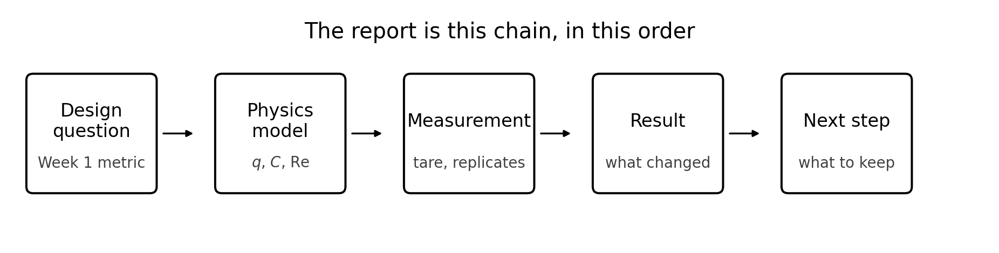
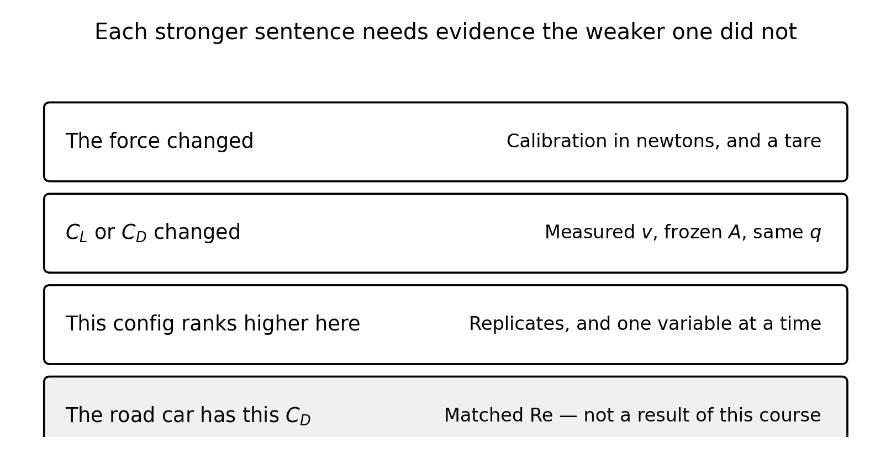

<!--
npx @marp-team/marp-cli curriculum/slides/week-10-lecture.md -o curriculum/slides/week-10-lecture.pdf --allow-local-files
-->

# Week 10
## Synthesis, the report, and the presentation

**Automotive Aerodynamics Independent Study**  
Industrial Design × Physics (DePaul)

Physics mentor · 10-week IS

---

# Today’s agenda

1. The report is one chain, in one order  
2. Which sentences your evidence can support  
3. What each section has to contain  
4. A results paragraph you can imitate with your numbers  
5. The 10–12 minute talk  
6. What this course did, and did not, make you ready to claim  

---

# Learning targets (by end of Week 10)

You will be able to:

- Order the report as question, model, measurement, result, recommendation  
- Match each claim to the evidence it actually used  
- State uncertainty and the Reynolds-number limit without taking back the ranking you earned  
- Give a 10–12 minute talk that spends its time on the plots  
- Name what you would study next in the Physics minor  

---

# The chain

A CAD section that never meets a force, or a force table that never meets the Week 1 metric, is a different paper. This course’s paper is the chain.

---

# The claim ladder

Read it from the top. Each line needs everything above it, plus the evidence on the right.

The gray line is the one this independent study does not earn. Model $C_D$ is not full-scale $C_D$. Week 5 already did that arithmetic: matching Re in room air wanted $300\,\mathrm{m/s}$.

---

# Suggested report, about 8–15 pages

Quality over bulk. Figures count. Repeated screenshots do not.

1. **Design brief** — the question and the success metric, copied from Week 1, not rewritten to fit the winner  
2. **Physics framework** — signs, $q$, $C_D$ and $C_L$, frozen $A$, Re disclaimer  
3. **Apparatus** — scale, sensing axis, calibration slope, tare, how you got $v$, protocol  
4. **Results** — AoA sweep; underbody tests; the 2×2, with the residual  
5. **Discussion** — what matched the sketch, what stalled, what did not add  
6. **Recommendations** — what the modular kit should keep, under the metric  
7. **Personal learning** — concepts you can now use, and the next course  

Put the report in `docs/final-report.md` or a PDF next to it.

---

# Section 1 — the brief you are not allowed to edit

One paragraph. Include:

- The question (“which modular package…”)  
- The metric in a sentence a stranger can apply (“maximum $|C_L|$ with $C_D$ at most …”)  
- What would count as a loss  

If Week 9’s champion only wins under a rule you invented this week, either the brief was incomplete or the champion is not the answer to the brief. Say which.

---

# Section 2 — the physics, short and signed

You need these, and you do not need a fluids textbook pasted underneath them:

$$
q=\tfrac12\rho v^2, \qquad F_D = q C_D A, \qquad F_L = q C_L A
$$

$C_L$ up-positive. Downforce is negative lift. $A$ is the frontal area you froze, stated in square meters. $L$ in Re is the model length you froze.

Then the three Week 5 sentences, with your $L$, your $v$, and your Re filled in. They go here, and again anywhere a coefficient could be mistaken for the road car’s.

---

# Section 3 — apparatus a stranger could repeat

Include:

- Model scale and the frozen $L$  
- Which axis each cell measures, and the calibration slope in newtons per count  
- Tare: model on, fan off  
- How $v$ was measured, or the fan curve and its uncertainty  
- The protocol line: one variable, three replicates, closing baseline when the matrix is long  

A photograph of the fixture with the flow direction marked is enough. A wiring diary is not the section.

---

# Section 4 — results are plots plus the sentence they support

Every plot or table needs:

- Config ids  
- Mean, and the replicate spread  
- $v$ or Re, and $A$, in the caption  
- Units, or a dimensionless symbol you defined ($C_L$, $C_D$, $\mathcal{E}$)  

Three plots carry the course:

1. $C_L$ and $C_D$ versus $\alpha$ (Week 7)  
2. Underbody comparison at fixed $\alpha$ and recorded $h$ (Week 8)  
3. The 2×2, solos against the pair (Week 9)  

A plot with no sentence under it is a screenshot. The sentence has to be one the claim ladder allows.

---

# A results paragraph, lecture numbers only

Replace every number. Do not leave these in the report.

> At $q=135\,\mathrm{Pa}$ and $A=0.015\,\mathrm{m^2}$, wing-only changed $F_z$ by $-1.2\,\mathrm{N}$ and diffuser-only by $-0.8\,\mathrm{N}$. Both together changed $F_z$ by $-1.5\,\mathrm{N}$, which is $0.5\,\mathrm{N}$ less downforce than the sum. That residual is larger than a 5% uncertainty on a $1.5\,\mathrm{N}$ force. Under a drag cap of $1.30\,\mathrm{N}$, the wing-only config is the champion in this example. These coefficients rank the fixture at model Re. They are not full-scale coefficients.

If your residual is inside the spread, the honest sentence is the opposite: the pair is consistent with additivity, and you do not invent a fight the data do not show.

---

# Section 5 — discussion is the mismatch

Write three short blocks.

**Angle.** Where $|C_L|$ peaked, where $\mathcal{E}$ peaked, and whether stall showed up as separation rather than as a wish. If the peak was early, connect it to Re.

**Underbody.** Throat versus recovery, in that order, and the measured $h$. If ride height did nothing, that is the finding.

**Interaction.** The residual in words, then the two systematic errors you checked (closing BASE, and whether $h$ or $\alpha$ actually stayed fixed).

“The diffuser adds grip” is not a discussion sentence.

---

# Section 6 — the recommendation is a part list

Under the metric, name:

- What stays on the kit (wing angle, diffuser, splitter, ride height)  
- What comes off, and the drag or downforce you refused  
- One change you would print next, and the single variable that test would move  

A recommendation that needs a full-scale $C_D$ is out of bounds. A recommendation that says “on this platform, at this Re, keep WING at $10^\circ$ because $\mathcal{E}$ peaked there” is in bounds.

---

# Section 7 — what you can do now

You came in with algebra-based mechanics. You can now:

- Draw an FBD in which downforce raises $N$ and does not change $m$  
- Use $q$ as kinetic energy per volume, and $C$ as the fraction of $qA$ left after the pressure map  
- Say when Bernoulli does not apply  
- Compute Re and refuse a full-scale coefficient  
- Turn a load cell into newtons and propagate a speed error into $C_D$  
- Run a one-variable test and an interaction residual  

That list is the personal-learning section. It is also the honest description of the course.

---

# What to take next

This course does not replace a calculus-based fluids course.

Sensible next steps, with your mentor:

- Finish the calculus sequence if it is not done. The stretch ideas in this course (slopes, $v^2$) become derivatives there.  
- Intermediate mechanics.  
- A fluids or computational-physics elective when one is offered.  

You do not need to pretend the model was a wind tunnel in order to be ready for those courses. The readiness is the list on the previous slide.

---

# The talk, 10–12 minutes

| Time | Job |
|------|-----|
| 1 min | Design question and the metric, unchanged |
| 3 min | The physics that decided a result: signs, $q$, stall or recovery, Re |
| 4 min | Two or three plots. Read one number off each. |
| 2 min | Champion, what you gave up, scaling sentence |
| rest | Questions |

A render tour is not the 4 minutes. If a plot is on screen, the sentence is the one under it in the report.

---

# Questions you should be able to answer

- Why is your $C_L$ negative?  
- Where is the low pressure on the underbody path, and where does $P$ rise?  
- Why is the pair not the sum of the solos, or why is it consistent with the sum?  
- What would the champion have been under the other legal rule?  
- Why is the model coefficient not the road car’s?  
- What is the largest uncertainty, and did the result clear it?  

If you cannot answer one of these, the report has a hole in that section. Fix the section. Do not prepare a different answer for the room.

---

# A strong sentence and a weak one

**Strong:** “At $\mathrm{Re}=4.5\times 10^{5}$ based on model length, $|C_L|$ peaked at $10^\circ$ and fell at $15^\circ$ by more than the replicate spread. I am ranking wing angles on this fixture.”

**Weak:** “The wing is faster.” “The diffuser seals the floor.” “$C_D=0.42$, so the car is efficient.” “The parts add because both are aero parts.”

The weak sentences fail the claim ladder. They are not saved by a confident slide.

---

# Repo cleanup that is part of the grade

- Labeled CSVs in `data/processed/`  
- Calibration and the protocol still findable from the report  
- CAD export notes: part ids, the frozen $\alpha$, the frozen $A$  
- README links if you added a report path  
- No coefficients in the abstract that lack $A$, $v$ or Re, and the disclaimer  

The celebration check from the week plan: the win is not a wind-tunnel match to a race car. The win is a design decision you can trace to a force, a coefficient, and a limit.

---

# Physics checkpoint — there is no new formula

The final report **is** the checkpoint. A reader who has not seen the fixture should be able to:

1. Apply your decision rule to your table and get your champion.  
2. Find $A$, $L$, $v$, and the tare in the methods.  
3. See the residual, or an explicit statement that the residual is inside the noise.  
4. Leave knowing the coefficients are a ranking at model Re.  

If one of those four is missing, the report is not finished.

---

# Deliverables checklist

| Deliverable | Where |
|-------------|--------|
| Final report | `docs/final-report.md` or a PDF beside it |
| Presentation slides | your deck, 10–12 minutes |
| Labeled data, CAD notes, README | repo |
| Short note on the Physics minor pathway | inside the report, section 7 |

---

# How you will be assessed on Week 10

**Strong:** metric unchanged from Week 1; plots with spread, $A$, and Re; residual handled honestly; champion follows the rule; disclaimer present; the talk reads the plots.  
**Weak:** a new metric in the conclusion; full-scale language; stall or recovery with no evidence; an interaction story inside the noise; most of the 12 minutes on renders.

---

# Instructor talking points

- Grade the chain, not the gloss of the CAD.  
- If the champion changed the metric, send them back to Week 1 before the talk.  
- A negative result with a clean protocol outranks a large $C_L$ with no tare.  
- The scaling paragraph is required even when the student is proud of the number.  

---

# References for this lecture

- Course note: [`physics/10-reporting-claims.md`](../../physics/10-reporting-claims.md)  
- Week plan: [`curriculum/week-10-synthesis.md`](../week-10-synthesis.md)  
- Disclaimer template: Week 5 lecture, and [`physics/05-reynolds-and-scaling.md`](../../physics/05-reynolds-and-scaling.md)  
- Uncertainty: [`physics/06-uncertainty-basics.md`](../../physics/06-uncertainty-basics.md)  
- Mentor checklist: [`docs/mentor-guide.md`](../../docs/mentor-guide.md)  
- Figures: [`curriculum/slides/figures/`](figures/)

---

# End of the lecture sequence

**Next actions**

1. Freeze the Week 1 metric at the top of the report  
2. Put $A$, Re, and the tare where a stranger can find them  
3. Write the residual in words, or say it is inside the noise  
4. Build the talk around two plots and the disclaimer  

The course asked you to use physics to choose a part. That choice, with its limit stated, is the finished work.

Questions?
